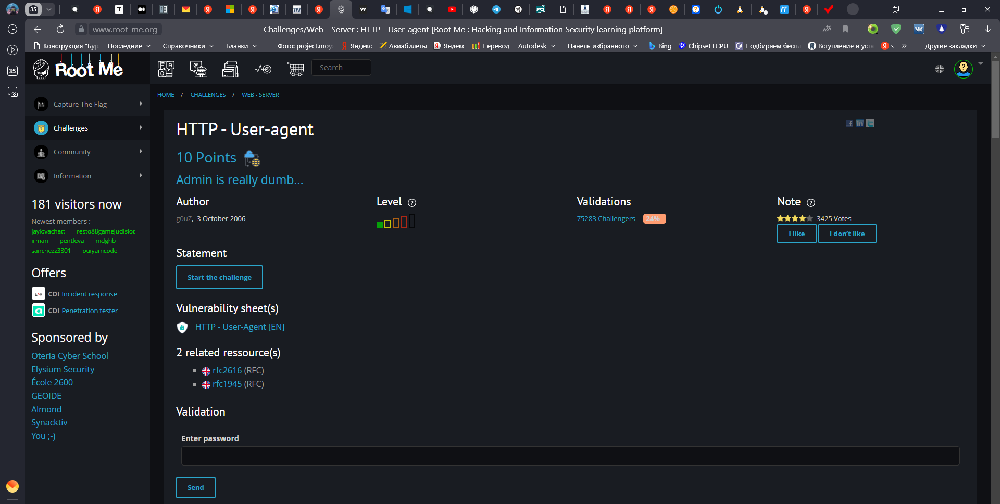
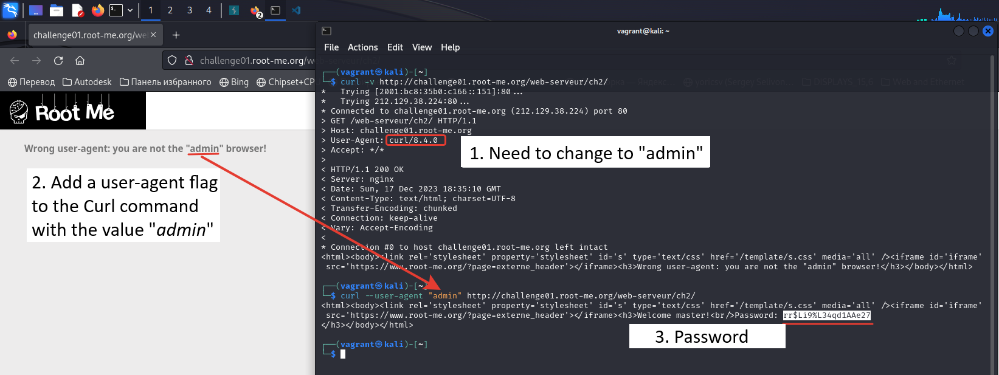
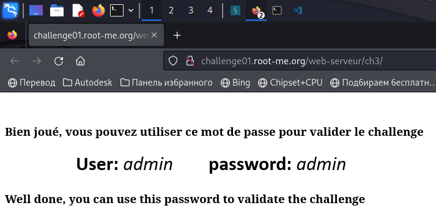
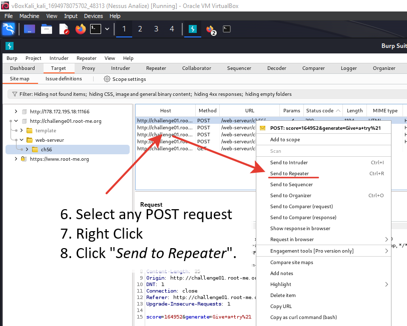

# [Web Application Security Testing](../README.md) -> __Report for the 20231211 lesson 2__

- [Web Application Security Testing -\> __Report for the 20231211 lesson 2__](#web-application-security-testing---report-for-the-20231211-lesson-2)
  - [__Root Me (HTML - Source code)__](#root-me-html---source-code)
  - [__Root Me (HTML - User-agent)__](#root-me-html---user-agent)
  - [__Root Me (Weak password)__](#root-me-weak-password)
  - [__Root Me (HTTP - Headers)__](#root-me-http---headers)
  - [__Root Me (HTTP - POST)__](#root-me-http---post)

## __Root Me (HTML - Source code)__

Solution:

1. Press the `[F12]` key to open the developer tools.
2. Go to the `[Inspector]` tab to research the source code.
3. The html page contains a commented out password.

   

## __Root Me (HTML - User-agent)__

Solution

1. On the challenge page there is a hint that we are using the wrong browser.
2. If we look at the server response, we can verify that the User-agent contains `curl/8.4.0`, but we must use the browser "*`admin`*". Of course, to solve this problem, we should change the User-Agent request header.
3. Add the __--user-agent__ flag with the modified header “*`admin`*”.
4. Collect the flag

   

## __Root Me (Weak password)__

This challenge can be solved in 2 ways:

1. Brute force method
2. Use the lists of “*`Most-used Passwords`*”

> __NOTE:__
>
> For example, I used 10 lists from CyberGhost
>
> 

Honestly, every time the first thing I do is try the following pairs:

- `admin`/`''`,
- `admin`/`admin`,      <- valid
- `admin`/`password`,
- `admin`/`password1`,
- `admin`/`password123`,
- `admin`/`passw0rd`,
- `admin`/`passwd`,
- `root`/`''`,
- `root`/`root`,
- `root`/`toor`,
- `root`/`password`,
- `root`/`passw0rd`,
- etc.

After manually entering the username - `admin` and password - `admin` I logged in.

## __Root Me (HTTP - Headers)__

Solution

1. On the challenge page there is a hint that the content isn't only part of an HTTP response.
2. Use Curl with the __-v__ flag for more verbosity.
3. Here is an additional header and we can use it to change the response.
4. Add the __-H__ or __--header__ flag to modify the additional header with the value of `Header-RootMe-Admin: true` to Curl.

   > __NOTE:__
   >
   > The first time I was in a hurry and copied a line from the answer, I forgot to change the `none` value to `true` (*for elevation*) and press `[Enter]`. This is amazing, the server responded to me with a password page. I sent a few additional requests and found that the value had no effect and must contain at least one character.

5. The response contains the password.

## __Root Me (HTTP - POST)__

Solution

> __NOTE:__
>
> To solve this problem, Curl is not enough, you need to use a proxy (*e.g.: Burp Suite*).

1. Run the challenge
2. Launch "*Burp Suite*"

   

3. Start a challenge from the "*<www.root-me.org>*".
4. Go to the challenge page and click the `[Try it!]` button.
5. Return here and go to the `[Terget]` tab -> `[Site Map]` tab.
6. Find the challenge host (*e.g.: ch_*)

   

7. Select any POST request
8. Right click
9. Click "*Send to Repeater*"

   

10. Go to the `[Repeater]` tab
11. Change the value to *1000000*
12. Click the `[Send]` button
13. Collect the flag

    
