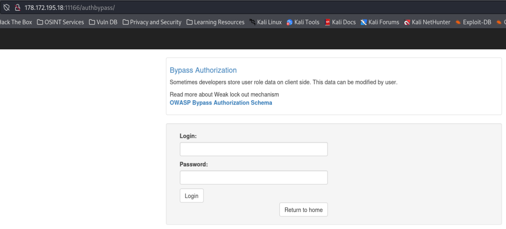
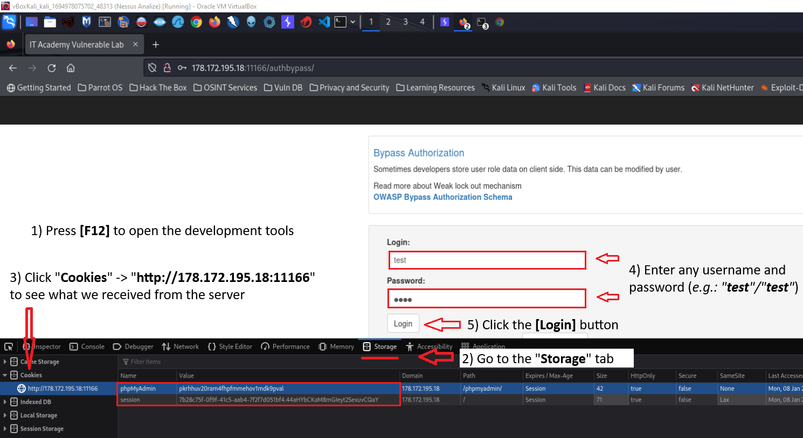
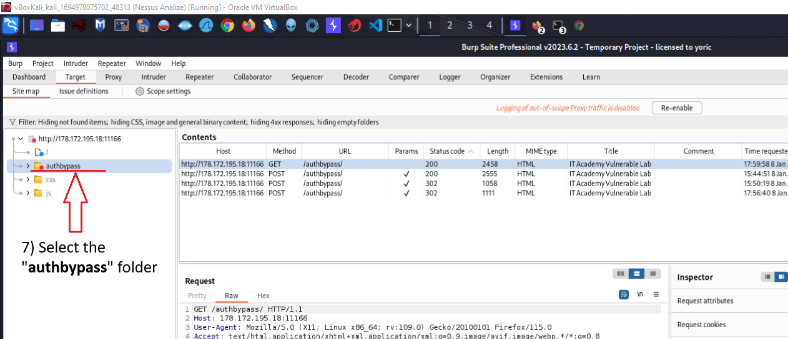
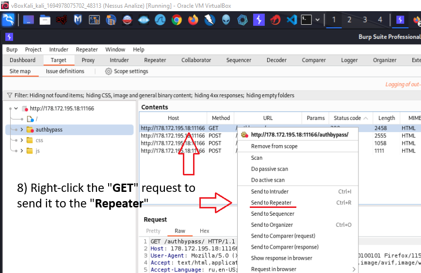
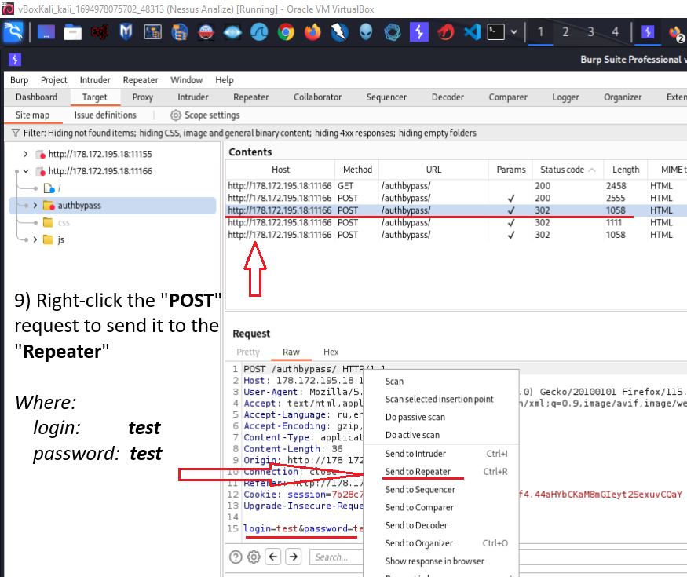
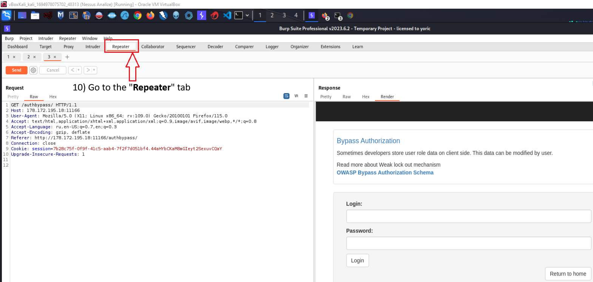
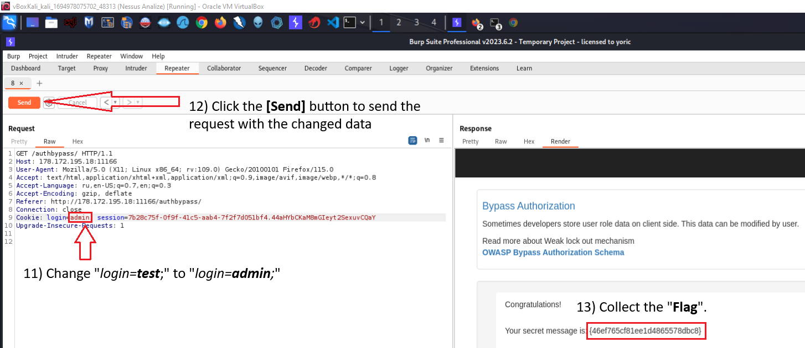
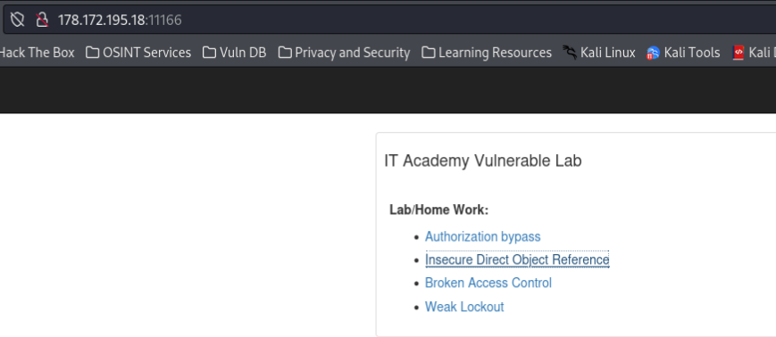
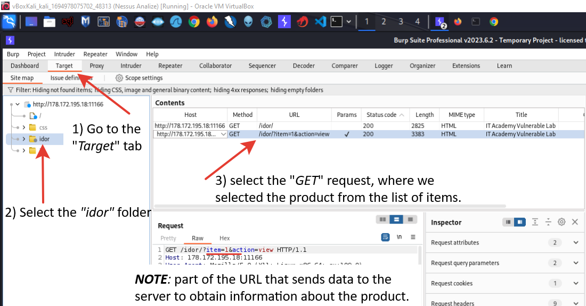
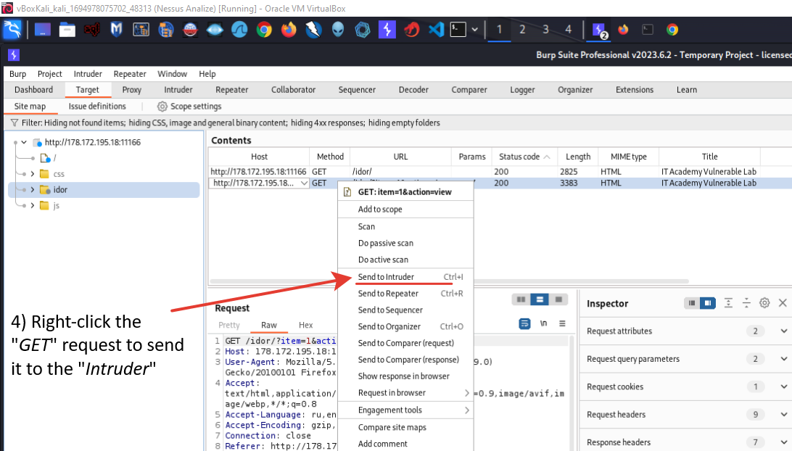

# [Web Application Security Testing](../README.md) -> __Report for the 20231218 lesson 3__

- [Web Application Security Testing -\> __Report for the 20231218 lesson 3__](#web-application-security-testing---report-for-the-20231218-lesson-3)
  - [__Authorization bypass__](#authorization-bypass)
  - [__Insecure Direct Object Reference__](#insecure-direct-object-reference)
  - [__Broken Access Control__ \<- *I missed the access time*](#broken-access-control---i-missed-the-access-time)
  - [__Weak Lockout__ \<- *I missed the access time*](#weak-lockout---i-missed-the-access-time)

## __Authorization bypass__

Solution

1) Run the __Authorization Bypass__ task.

   

2) Press the `[F12]` button to open the developer tools.

3) Go to the "*Storage*" tab.

4) Click "*Cookies*" -> "*<http://178.172.195.18:11166>*" to see what we received from the server.

   > __NOTE:__ We have 2 cookies: "*phpMyAdmin*" and "*session*".

5) Enter any username and password (*e.g.: `test`/`test`*)

6) Click the `[Login]` button

   

7) Once we log in, the *welcome* page appears and a new "*login*" cookie contains the "*username*" our entered.

   

8) Run __Burpsuite__ to drill down into events and compare behavior.

    

9) Expand the host tab "<http://178.172.195.18:11166>".

10) Select the "`authbypass`" folder to see the requests.

11) In the Content area, right-click the "*GET*" request to send it to the "*Repeater*".

    

12) Then we do the same for the "*POST*" request, to which we send the login and password (*`test`/`test`*).

    

13) Go to the "*Repeater*" tab.

    

    > __NOTE:__
    >
    > If we compare an "*Authorized*" request with an "*Unauthorized*", we will only find the difference in the cookies.
    >
    > Upon "*Autorized*" request from the server, we receive a welcome page with the message "__You are not an admin, there is no secret info here!__" and the request contains cookies with a new line "`login=test ;`".

14) Change "`login=test;`" to "`login=admin;`";

    

15) Click the `[Send]` button to resend the request with the changed data.

    

16) The answer has been changed and we see that the new welcome page contains a flag.

## __Insecure Direct Object Reference__

Solution

1) Launch __Burpsuite__ to be able to automatically brute values.
2) Go to the "*Target*" tab.
3) Expand the host tab "<http://178.172.195.18:11166>".
4) Select the "*idor*" folder to see the requests.
5) In the Content area,  select the "*GET*" request, where we selected the product from the list of items.

   

   > __NOTE:__
   >
   > `?item=1&action=view` - part of the URL that sends data to the server to obtain information about the product.

6) Right-click the "*GET*" request to send it to the "*Intruder*".

   

7) Go to the "*Intruder*" tab.

8) Using the mouse, select the number '1' (*depends on your choice in the product list*) in the request
9) Click `[Add§]` to mark which value will be automatically changed.

10) Choose an attack type "*Sniper*"

    

    > __NOTE:__
    >
    > Since we will only be affecting one value, select the `Sniper` attack type.

11) Go to the Payloads tab.

    

12) Select __Payload Type__ as “Numbers”.
13) Set the following properties for the "*Number Range*"

    - Type => `Sequential`
    - From => `0`
    - To   => `100`
    - Step => `1`

14) Click the `[Start Attack]` button.

15) When the attack is complete, click "*Length*" to sort the length of the response and understand what content the response has.

    > __NOTE:__
    >
    > All responses of the same length tell us that there is no suitable content to view and we can ignore them. The same situation with the first and second request (*`item=0` and `item=1`*).
    >
    > Now we can see that the only payload range that makes sense is from __1__ to __8__. As we remember, there are only *5* items in the item list, but after the attack __we can find 3 more__.
    >
    > Let's see what they contain.

16) To do this, click on the "*Response*" tab.
17) Go to the "*Render*" tab to convert the code into the appearance of the web page.
18) Then select the payload number from 6 to 8 to view them.
19) The response from payload 7 contains a flag.

## __Broken Access Control__ <- *I missed the access time*

> __NOTE:__ I missed the time to have an access and solve this task.

## __Weak Lockout__ <- *I missed the access time*

> __NOTE:__ I missed the time to have an access and solve this task.
