# [Web Application Security Testing](../README.md) -> __RootMe__

- [Web Application Security Testing -\> __RootMe__](#web-application-security-testing---rootme)
  - [__Root Me (*HTML - Cookies*)__](#root-me-html---cookies)
  - [__Root Me (*CSRF - 0 protection*)__](#root-me-csrf---0-protection)

## __Root Me (*HTML - Cookies*)__

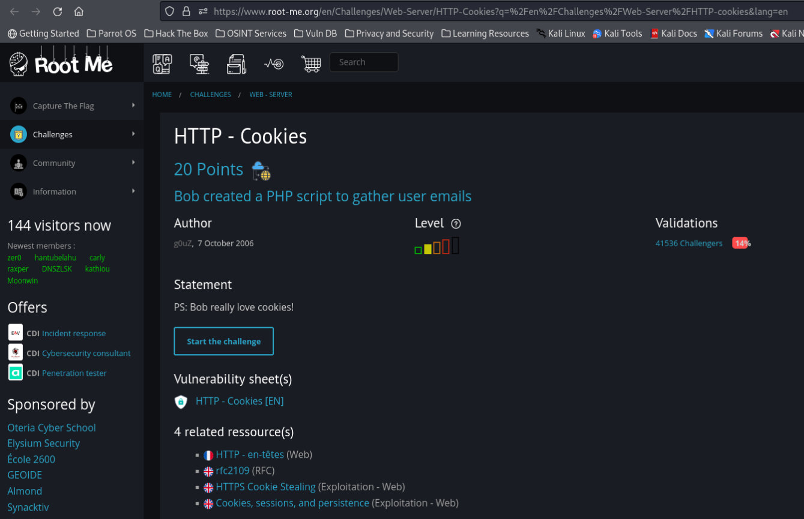

Solution:

1. Start the challenge
2. Press the `[F12]` button.
3. Go to the "*Storage*" tab
4. Expand the "*Cookies*" menu.
5. Click the "__Saved Email Addresses__" link.
6. There is a new cookie `ch7=visiteur`.

   > __HINT:__ You need to be an admin.

7. Replace the word "*visiteur*" with "*`admin`*".

   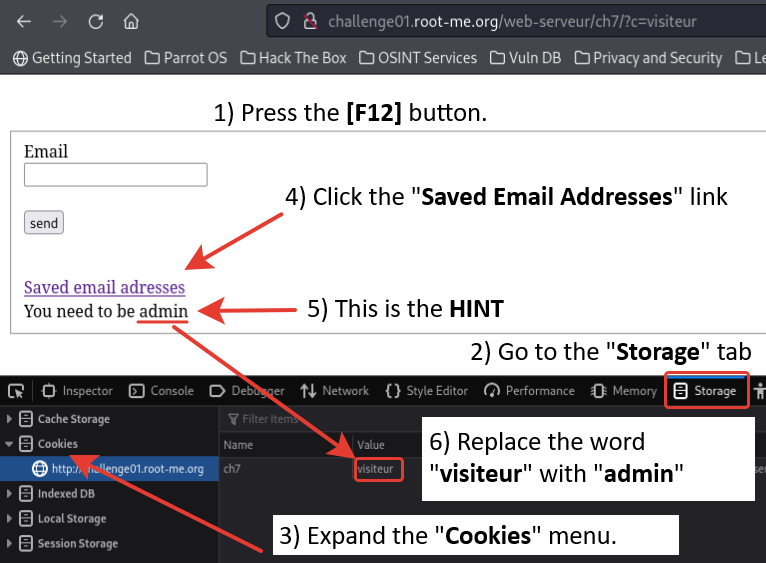

8. Press `[F5]` to refresh the page.
9. Collect the "Flag".

   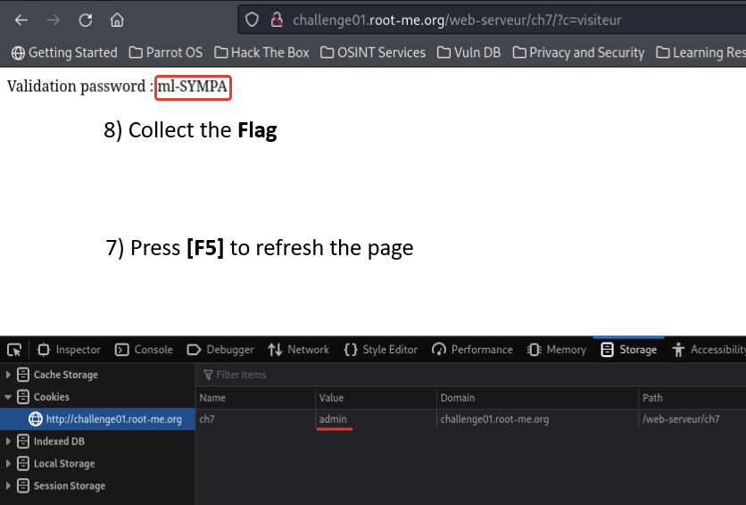

## __Root Me (*CSRF - 0 protection*)__

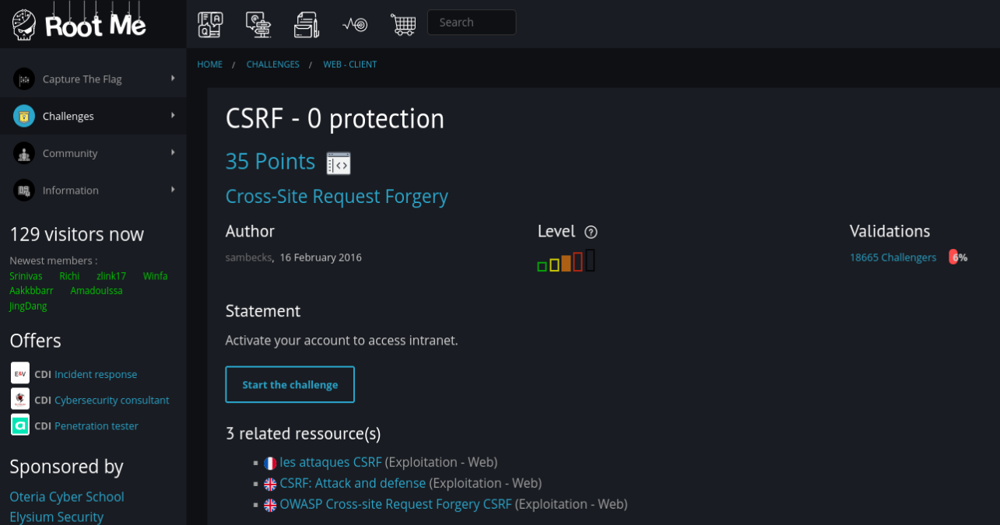

Solution:

1. Start the challenge.
2. Click the "__Register__" link.

   

3. Enter any *Login* and *Password* to registration a new user (*e.g.: `user` / `user`*).
4. Click the `[Submit]` button.

   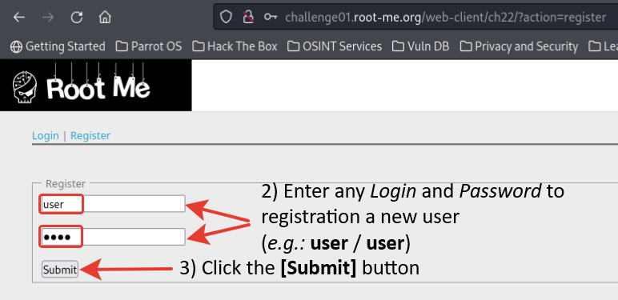

5. Click the "__Log in__" link.

   

6. Enter again *Login:* `user` and *Password:* `user` to log in.
7. Click the `[Sign in]` button.

   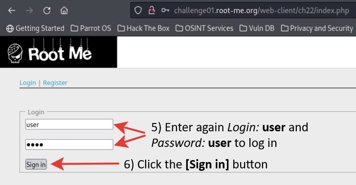

8. Click the "__Profile__" link.

   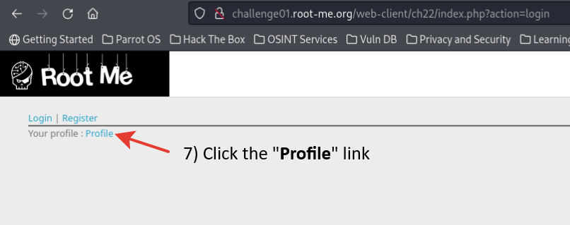

9. Try changing our profile.

   

   After clicking the `[Submit]` button, we received the message "*You're not an admin!*". Great! We may be able to do this after changing the privacy settings on the *Private* tab. Let's go there.

10. Click the "__Private__" link.

    

    > __NOTE:__ Here we saw another message: "*Your account has not been verified by the administrator, please wait.*." Great! The last tab is “*Contact*”, go there.

11. Click the "__Contact__" link.

    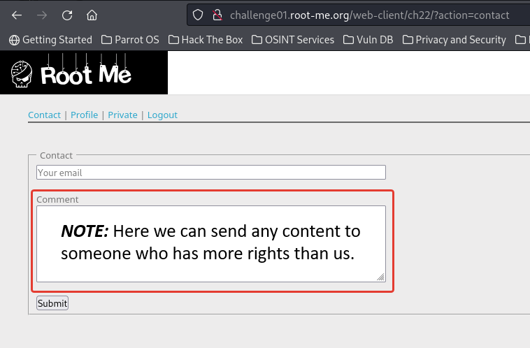

    Here we can send any content to someone who has more rights than us. We can use CSRF to attack.

    To carry out this attack, we need to create an HTML form with the same parameters as in the profile tab. Then change it so that it works when the admin opens our message. It should run in the background to change our profile with privileged rights.

12. Return to the "*Profile*" tab.
13. Right-click anywhere on the page and select "*View Page Source*".

    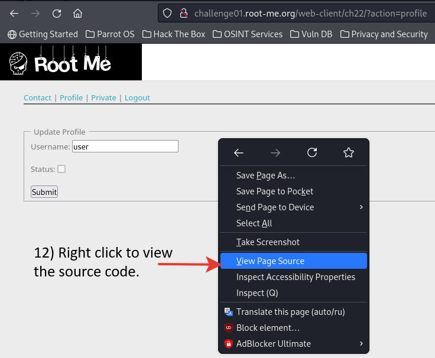

14. Let's look at the source code to see what we can use to prepare a hidden HTML form.

    

    We can use the following lines:

    - `http://challenge01.root-me.org/web-client/ch22/` - URL of the location of Internet resources. We must provide the full URL where the resources are located because the form only contains internal links, but we plan to place them elsewhere, which may not work.

    - `<form action="?action=profile" method="post" enctype="multipart/form-data">` - form opening tag. Here we need to add an external URL link for it to work properly.

    - `<input type="text" name="username" value="user">` - is the field in which we want to change the value.

    - `<input type="checkbox" name="status" disabled>` -  this field is necessary to unlock our profile.

    - `<button type="submit">Submit</button>` - activation form button.

    - `</form>` - closing tag of the form.

15. Open your preferred text editor and create an HTML file as shown below.

    

16. Go to the "*Contact*" tab.
17. Enter any email address and paste the code from step 15.
18. Click the `[Submit]` button.

    

19. If successful, the message “*Your message has been posted. The administrator will contact you later.*" will appear below.

    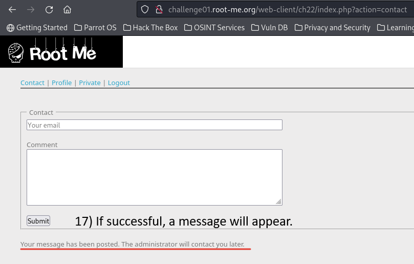

20. Wait 3-5 minutes and the "*Flag*" will appear on the "*Private*" tab.

    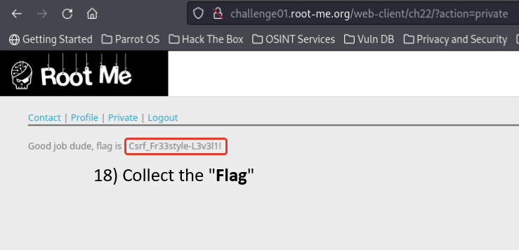
