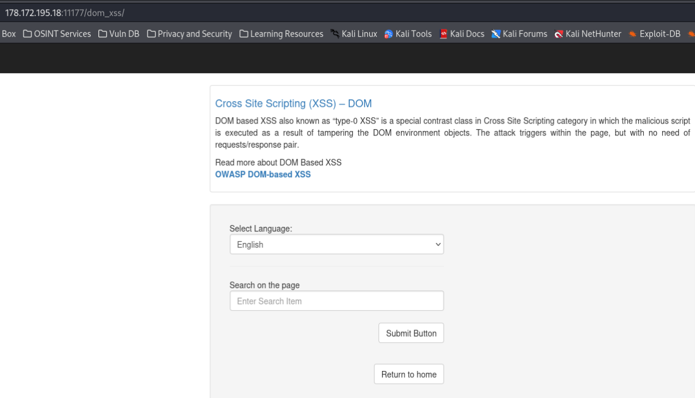
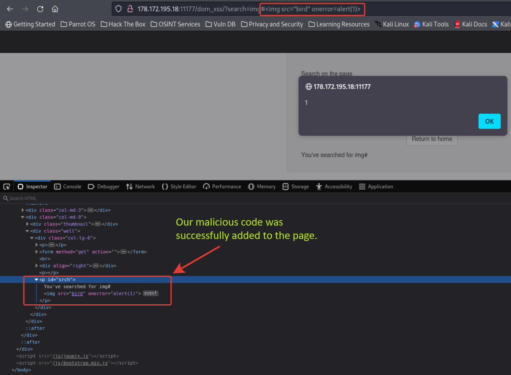
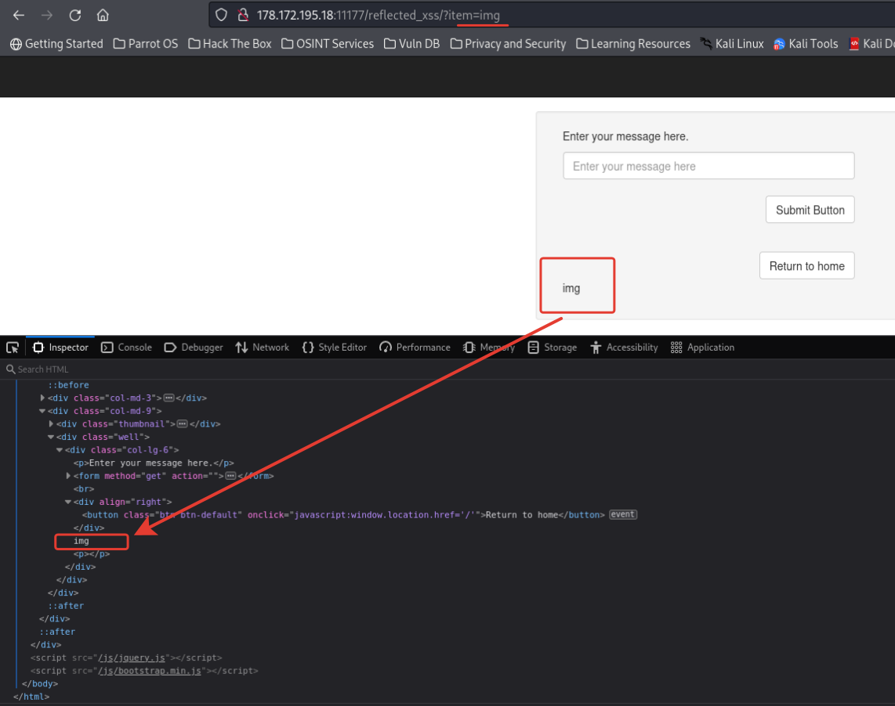
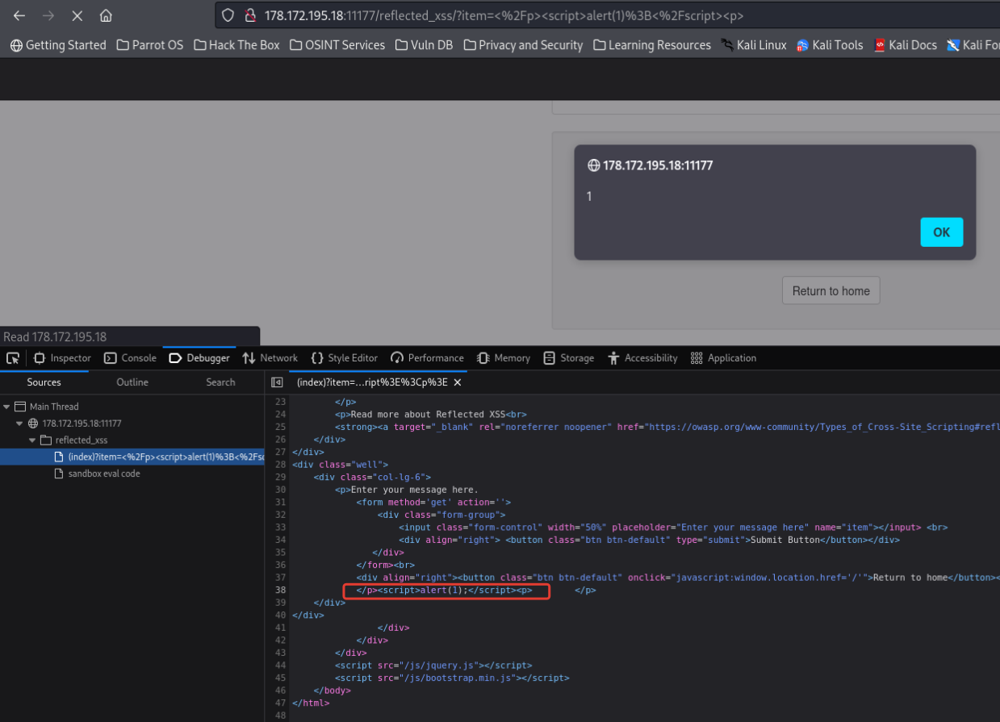
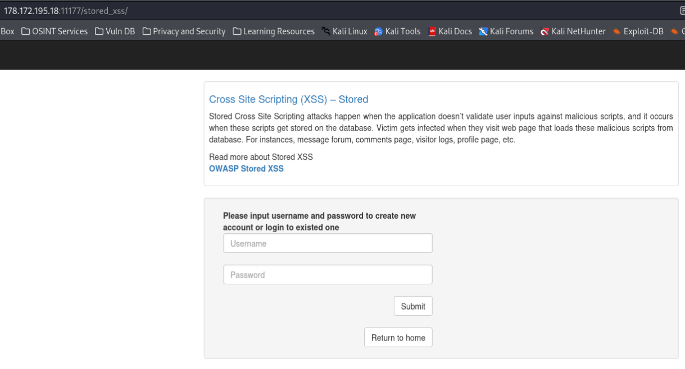
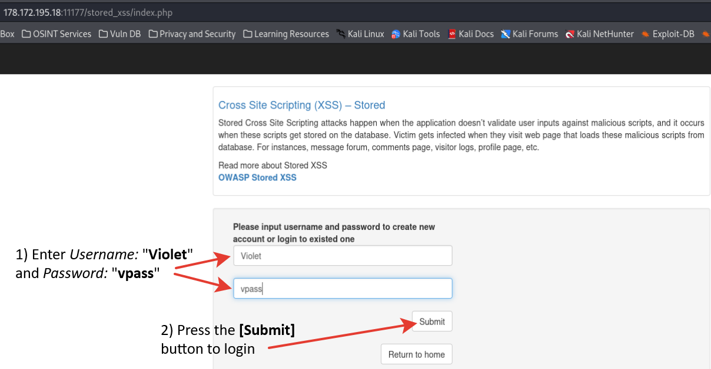
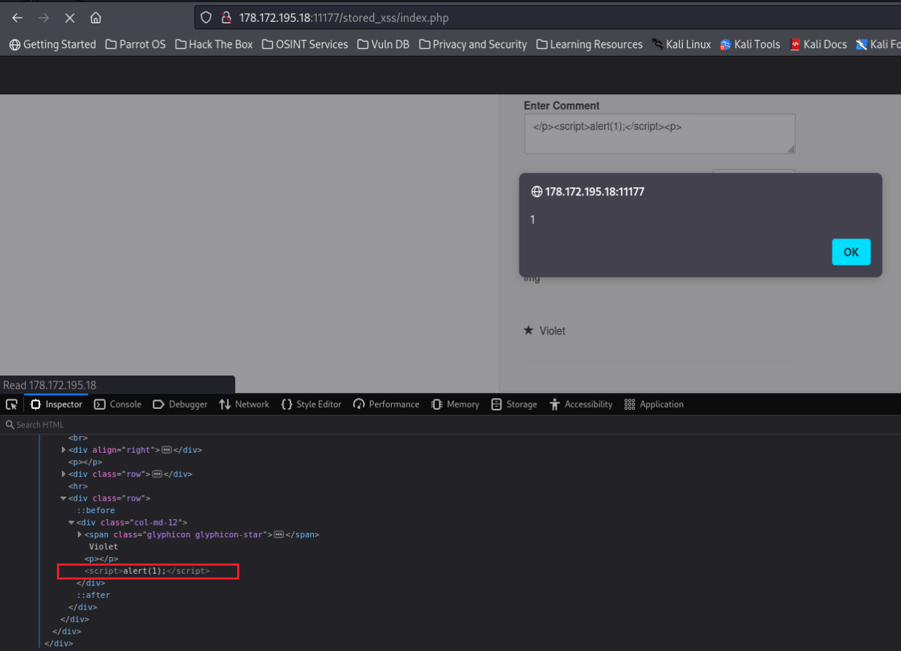

# [Web Application Security Testing](../README.md) -> __DOM XSS, Reflected XSS, Stored XSS__

- [Web Application Security Testing -\> __DOM XSS, Reflected XSS, Stored XSS__](#web-application-security-testing---dom-xss-reflected-xss-stored-xss)
  - [__DOM XSS__](#dom-xss)
  - [__Reflected XSS__](#reflected-xss)
  - [__Stored XSS__](#stored-xss)

## __DOM XSS__

Solution

1. Run the task.
2. Enter any search query (*e.g.: `img`*)
3. Press the `[Enter]` button.
4. To insert malicious code into the DOM, you need to use an anchor tag (*`#`*) and then add ``.

5. Press the `[Enter]` button.

   > __NOTE:__ After executing the search script, the malicious code will be included and stored inside the html page.

6. To check if malicious code has been included in the html code:
   1. Press the `[F12]` button (*to open the developer toolbar*).
   2. Go to the "*Inspector*" tab.
   3. Find the `
` tag.

   

## __Reflected XSS__

Solution

1. Run the task.
2. Enter any search query (*for example: `img`*)
3. Click `[Submit Button]`.

   

   > __NOTE:__ As we can see, our search query has been inserted into the page.

4. Type `` and click `[Submit Button]` to insert the malicious code.

   

   Something is going wrong. Let's see what happened.

5. Press the `[F12]` button (*to open the developer toolbar*).
6. Go to the "*Debugger*" tab.
7. Expand all branches of the "*Sources*" menu.
8. Here we found the file `(index)`.
9. Our code was added, but we missed the open tag `
` and "XSS" is not supported here.
10. Let's change our code to `

`

11. Click `[Submit Button]`.
12. Malicious code works.

    

## __Stored XSS__

Solution

1. Run the task.
2. Enter *Username:* `Violet` and *Password:* `vpass`.
3. Press the `[Submit]` button.

   

4. Enter any comment (*e.g.: `img`*)
5. Click `[Submit Button]`.

   

   Our comment has been stored and published.

6. Type `

` and click `[Submit Button]` to store the malicious code.

7. Malicious code is executed and stored. Everyone who visits this page will encounter this.

   
