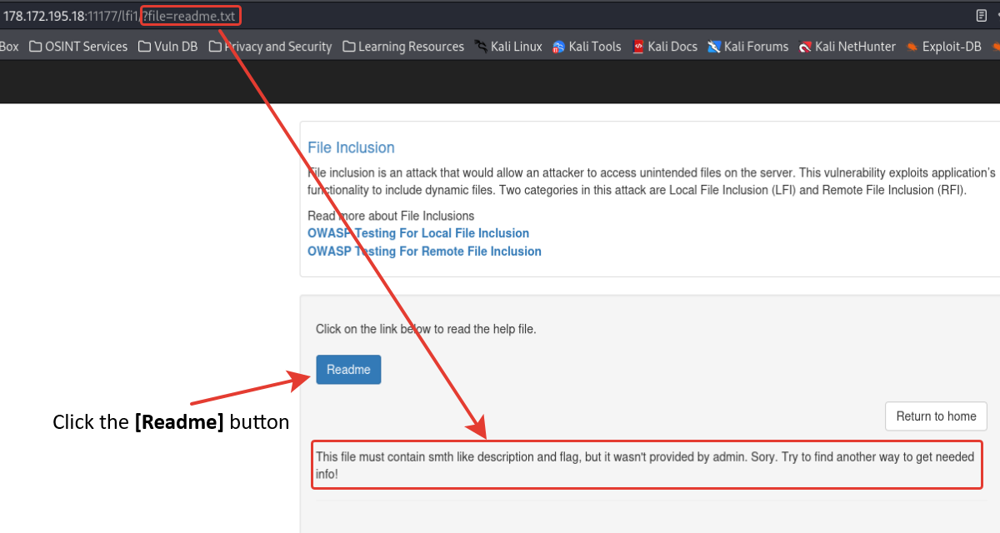
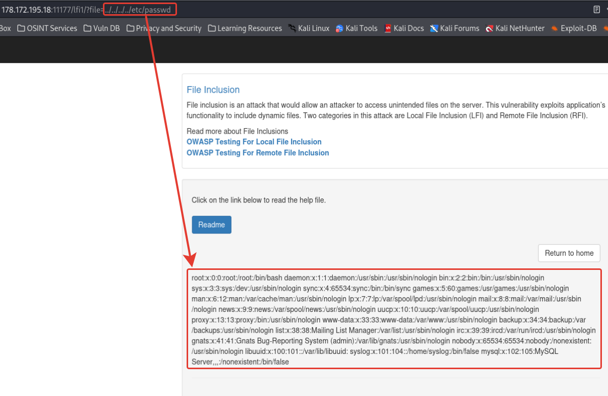
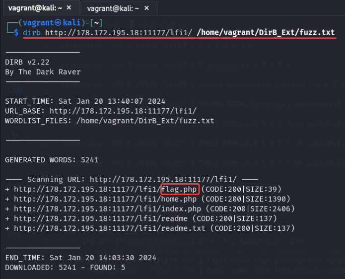
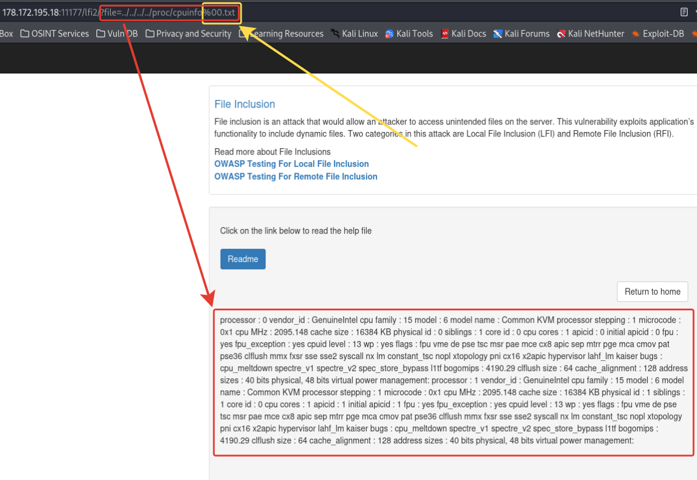
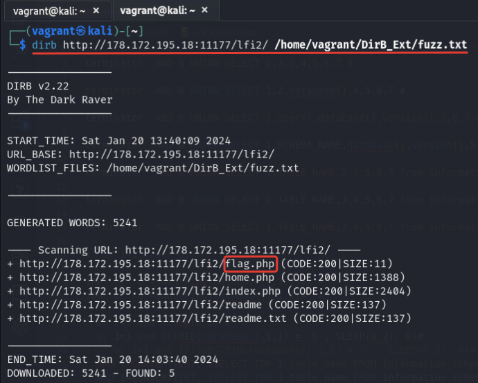
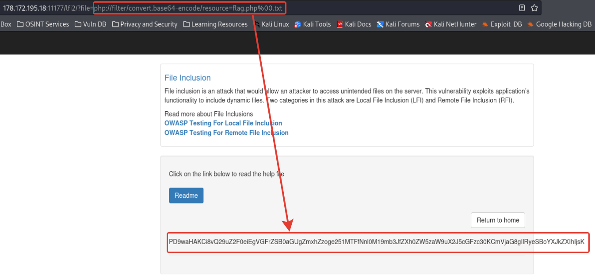
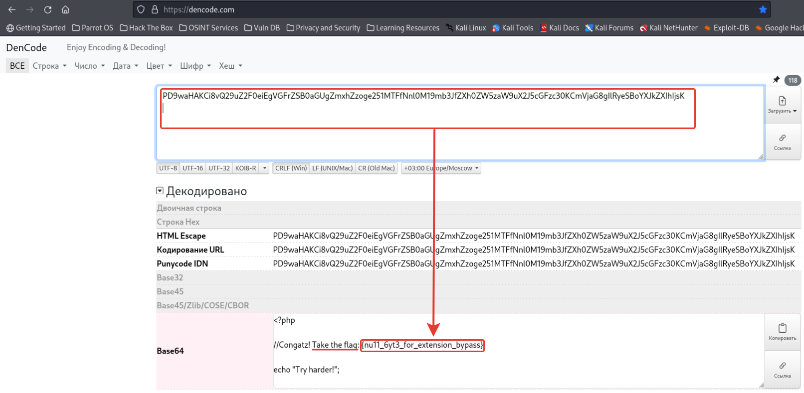

# [Web Application Security Testing](../README.md) -> __Local File Inclusion (Task 1, Task 2)__

- [Web Application Security Testing -\> __Local File Inclusion (Task 1, Task 2)__](#web-application-security-testing---local-file-inclusion-task-1-task-2)
  - [__Local File Inclusion 1__](#local-file-inclusion-1)
  - [__Local File Inclusion 2__](#local-file-inclusion-2)

## __Local File Inclusion 1__

1. Run the task.

   

2. Click the `[Readme]`" button.

   

3. Check for Local file inclusion vulnerabilities.

   1. Let's check that the `readme.txt` file is in the same directory as the `index.php` file.
   2. Change the URL and remove `?file=` from it, leaving only `readme.txt`.
   3. Press  the `[Enter]` button.

   

   The file is accessible and contains only text.

4. Let's check the ability to read files of the Linux operating system. Type `../../../../etc/passwd` or `../../../../proc/cpuinfo` and press `[Enter]`.

   

   > __NOTE:__
   >
   > `../../../../` — nesting depth up to the root directory. First I checked the nesting depth and it turned out that the path from the root directory to the web application location is __4__.
   >
   > I've run other tests to see what techniques I can use (*e.g.: ability to load PHP exploit code via user agent with or without encoding, remote online resources, etc.*), but nothing works as a result.

5. We should check what other files and folders are on the server.

   1. Press the key combination `[Ctrl]`+`[Alt]`+`[T]` to launch the terminal.
   2. Enter the following command to run the __dirb__ utility.

   ```sh
   dirb http://178.172.195.18:11177/lfi1/ /home/vagrant/DirB_Ext/fuzz.txt
   ```

   > __NOTE:__
   >
   > `/home/vagrant/DirB_Ext/fuzz.txt` - path to the custom word list. It needs to find special files such as "*flag*" because it isn't in the main word list. You can upload any custom word list file or add your own words to the standard file (*located at: `/usr/share/dirb/wordlists/common.txt`*).

   

6. Let's check the contents of `flag.php`. Type `http://178.172.195.18:11177/lfi1/flag.php` into the address bar and press `[Enter]`.

   

   > __NOTE:__
   >
   > We received the message: "__*Try harder!*__" this happened because the server didn't show the contents of the file, it interpreted it and returned only the output message to us.
   >
   > If we want to get the source code, we need to use a php wrapper to encode the content of the file and decode it through any online service.

7. Let's change the GET request to the following `http://178.172.195.18:11177/lfi1/?file=php://filter/convert.base64-encode/resource=flag.php`

   

   > __NOTE:__
   >
   > - `?file=` - to use the PHP wrapper, you must use the PHP interpreter, available to us through the file upload mechanism. Also, if we try to use it without interpretation, the server will try to find the local file, but will not find anything and will return an error.
   > - `php://filter/convert.base64-encode/resource=flag.php` - all GET requests are collected as values inside the global php array (*`$_GET[]`*). Before adding, the php shell reads the "flag.php" file and encodes its contents into Base64 format. This value will be added to the global array as a string and the web application will display it for us.

8. Select and copy the entire Base64 format string.
9. Go to any online decoder or use Burpsuite's internal decoder (*I prefer <https://dencode.com>*).
10. Insert the value and find the decoded string.

    

11. Collect the "*Flag*".

## __Local File Inclusion 2__

1. Run the task.

   

2. Click the `[Readme]`" button.

   

3. Check for Local file inclusion vulnerabilities.

   1. Let's check that the `readme.txt` file is in the same directory as the `index.php` file.
   2. Change the URL and remove `?file=` from it, leaving only `readme.txt`.
   3. Press  the `[Enter]` button.

   

   The file is accessible and contains only text.

4. Let's check the ability to read files of the Linux operating system. Type `../../../../etc/passwd%00.txt` or `../../../../proc/cpuinfo%00.txt` and press `[Enter]`.

   

   > __NOTE:__
   >
   > __The difference from the first task__ is the addition of a zero byte `%00` with the extension `.txt`. Because without this we will get the error message "__*Only 'txt' files allowed!*__" and to bypass the scanner, add `%00.txt` to the end of the URL.
   >
   > `../../../../` — nesting depth up to the root directory. First I checked the nesting depth and it turned out that the path from the root directory to the web application location is __4__.
   >
   > I've run other tests to see what techniques I can use (*e.g.: ability to load PHP exploit code via user agent with or without encoding, remote online resources, etc.*), but nothing works as a result.

5. We should check what other files and folders are on the server.

   1. Press the key combination `[Ctrl]`+`[Alt]`+`[T]` to launch the terminal.
   2. Enter the following command to run the __dirb__ utility.

   ```sh
   dirb http://178.172.195.18:11177/lfi1/ /home/vagrant/DirB_Ext/fuzz.txt
   ```

   > __NOTE:__
   >
   > `/home/vagrant/DirB_Ext/fuzz.txt` - path to the custom word list. It needs to find special files such as "*flag*" because it isn't in the main word list. You can upload any custom word list file or add your own words to the standard file (*located at: `/usr/share/dirb/wordlists/common.txt`*).

   

6. Let's check the contents of `flag.php`. Type `http://178.172.195.18:11177/lfi1/flag.php` into the address bar and press `[Enter]`.

   

   > __NOTE:__
   >
   > We received the message: "__*Try harder!*__" this happened because the server didn't show the contents of the file, it interpreted it and returned only the output message to us.
   >
   > If we want to get the source code, we need to use a php wrapper to encode the content of the file and decode it through any online service.

7. Let's change the GET request to the following `http://178.172.195.18:11177/lfi1/?file=php://filter/convert.base64-encode/resource=flag.php%00.txt`

   

   > __NOTE:__
   >
   > - `?file=` - to use the PHP wrapper, you must use the PHP interpreter, available to us through the file upload mechanism. Also, if we try to use it without interpretation, the server will try to find the local file, but will not find anything and will return an error.
   > - `php://filter/convert.base64-encode/resource=flag.php%00.txt` - all GET requests are collected as values inside the global php array (*`$_GET[]`*). Before adding, the php shell reads the "flag.php" file and encodes its contents into Base64 format. This value will be added to the global array as a string and the web application will display it for us.

8. Select and copy the entire Base64 format string.
9. Go to any online decoder or use Burpsuite's internal decoder (*I prefer <https://dencode.com>*).
10. Insert the value and find the decoded string.

    

11. Collect the "*Flag*".

<!-- ## __Unrestricted File Upload__ -->
