# __Web Application Security Testing (*AltoroMutual*)__

- [__Web Application Security Testing (*AltoroMutual*)__](#web-application-security-testing-altoromutual)
  - [__STATEMENT OF CONFIDENTIALITY__](#statement-of-confidentiality)
  - [__INTRODUCTION__](#introduction)
  - [__DOCUMENT PROPERTIES__](#document-properties)
  - [__VERSION CONTROL__](#version-control)
  - [__EXECUTIVE SUMMARY__](#executive-summary)
    - [Scope of work](#scope-of-work)
    - [Project objectives](#project-objectives)
    - [Assumption](#assumption)
    - [Timeline](#timeline)
    - [Summary of Findings](#summary-of-findings)
    - [Summary of Recommendation](#summary-of-recommendation)
  - [__REPORTING__](#reporting)
    - [SQL Injections (Login bypass, Attack on Admin)](#sql-injections-login-bypass-attack-on-admin)
    - [XSS](#xss)
    - [Web Application Potentially Vulnerable to Clickjacking](#web-application-potentially-vulnerable-to-clickjacking)
    - [HTML Injections](#html-injections)
    - [Cookie Injection Scripting](#cookie-injection-scripting)
    - [Absence of Anti-CSRF Tokens](#absence-of-anti-csrf-tokens)
    - [Web Server Transmits Cleartext Credentials](#web-server-transmits-cleartext-credentials)
    - [HTTP Cookie without 'Secure' attribute](#http-cookie-without-secure-attribute)
    - [HTTP Cookie without 'SameSite' attribute](#http-cookie-without-samesite-attribute)
    - [Missing or Permissive __"*X-Frame-Options*"__ and __"*CSP frame-ancestors*"__ HTTP Response Headers](#missing-or-permissive-x-frame-options-and-csp-frame-ancestors-http-response-headers)
    - [HyperText Transfer Protocol (HTTP) Information](#hypertext-transfer-protocol-http-information)

## __STATEMENT OF CONFIDENTIALITY__

The contents of this document were developed by Selivonchik S. I believe that the contents of this document are not proprietary or business confidential information. This information should be used for educational purposes only. This document may be transferred to any other person without my prior consent. In addition, any part of this document may be transmitted, reproduced, copied or distributed without prior consent.

The contents of this document do not constitute legal advice and should not be construed as such. This is the result of my own educational process. The assessment detailed here is conducted on a fictitious company for training and testing purposes, and the vulnerabilities do not impact external or internal infrastructure in any way.

## __INTRODUCTION__

Black Box Penetration Testing
For altoro.testfire.net
FINAL TEST
V1.0

January 24th, 2024

By: Selivonchyk S.

## __DOCUMENT PROPERTIES__

| Title             | Black Box Penetration Testing Report  | Contacts  |
|-------------------|---------------------------------------|-----------|
| Version           | V1.0                                  |           |
| Author            | Selivonchyk S.                        |           |
| Pen-testers       | Selivonchyk S.                        |           |
| Reviewed By       | Kutaisov M.                           |           |
| Approved By       | Kutaisov M.                           |           |
| Classification    | Not confidential                      |           |

## __VERSION CONTROL__

| Version   | Date              | Author                | Description   |
|-----------|-------------------|-----------------------|---------------|
| V1.0      | Jan 24th, 2024    | Selivonchyk Sergey    | WAST          |

Table of Content

1. EXECUTIVE SUMMARY
   1. [Scope of work](#scope-of-work)
   2. [Project objectives](#project-objectives)
   3. [Assumption](#assumption)
   4. [Timeline](#timeline)
   5. [Summary of findings](#summary-of-findings)
   6. [Summary of recommendation](#summary-of-recommendation)

## __EXECUTIVE SUMMARY__

Altoro Mutual Banking Service is a publicly available application designed to test security scanners. This application can be used to evaluate and calibrate both automated vulnerability scanners and students taking web application security testing courses. This report describes methods and techniques for detecting vulnerabilities through manual testing. As well as testing the skills of documenting all research results in an understandable and reproducible form and developing the skills to provide recommendations for correcting situations.

### Scope of work

This work involves remotely testing a web application for real-world security vulnerabilities. Their existence must be confirmed, but without increasing attacks. The target runs on one available server located at <altoro.testfire.net>.

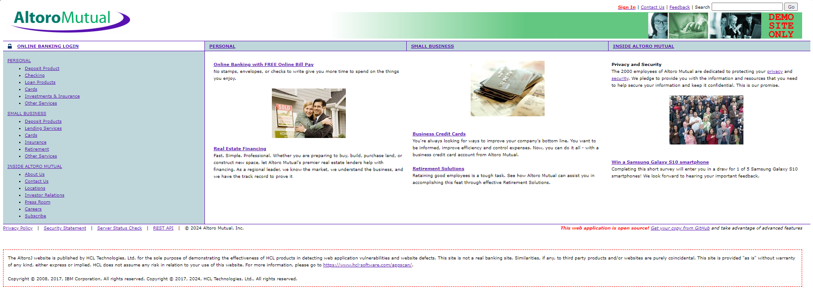

> __Figure 1__ *altoro.testfire.net*

The assessment was conducted from a "*black box*" perspective without any authority or prior knowledge of the internal environment. Only the URL of the server being tested is provided. No other information was expected.

In-Scope Assets

| Host/URL/IP Address/Port  | Description                           |
|---------------------------|---------------------------------------|
| `altoro.testfire.net`     | Published by HCL Technologies, Ltd    |

> __Table 1:__ *Scope details*

### Project objectives

Identify vulnerabilities and potential flaws in its design. Testing was done remotely using a URL. Each identified vulnerability is assigned a threat-based risk rating and manually reviewed to determine its potential for exploitation and escalation.

### Assumption

When writing this report, we assume that the resource has a special application designed for testing security scanners. This application can be used to evaluate and calibrate automated vulnerability scanners. It does not store or collect any sensitive data, and according to the home page, there is the following statement:

> The AltoroJ website is published by HCL Technologies, Ltd. for the sole purpose of demonstrating the effectiveness of HCL products in detecting web application vulnerabilities and website defects. . This site is not a real banking site. Similarities, if any, to third party products and/or websites are purely coincidental. This site is provided “as is” without warranties of any kind, express or implied. HCL does not accept any risk in connection with your use of this website. For more information, go to <https://www.hcl-software.com/appscan/>.

### Timeline

The timeline of the test is as below:

| Vulnerability detection   | Start date/time   | End date/time |
|:-------------------------:|:-----------------:|:-------------:|
| WAST 1                    | 01/23/2024        | 01/25/2024    |

> __Table 2:__ *Web Application Security Testing Time Line*

### Summary of Findings

This table shows the number of alerts for each __risk__ and __confidence level__ included in the report.

| Risk:     | High  | Medium    | Low   | Info  | TOTAL |
|----------:|:-----:|:---------:|:-----:|:-----:|------:|
| Amount    | 2     | 4         | 3     | 2     | 11    |

> __Table 3:__ *Total Risk and Confidence Rating*

### Summary of Recommendation

1. If available, use structured mechanisms that automatically enforce the separation between data and code. These mechanisms may be able to provide the relevant quoting, encoding, and validation automatically, instead of relying on the developer to provide this capability at every point where output is generated.
2. To help mitigate XSS attacks against the user's session cookie, set the session cookie to be HttpOnly. In browsers that support the HttpOnly feature.
3. Assume all input is malicious. Use an "*accept known good*" input validation strategy, i.e., use a list of acceptable inputs that strictly conform to specifications. Reject any input that does not strictly conform to specifications, or transform it into something that does.
4. - __Strong input validation__ - All user-controllable input must be validated and filtered for illegal characters as well as SQL content. Keywords such as `UNION`, `SELECT` or `INSERT` must be filtered in addition to characters such as a single-quote(*`'`*) or SQL-comments (*`--`*) based on the context in which they appear.
5. __Use of parameterized queries__ or stored procedures.
6. __Use of custom error pages__ - Attackers can glean information about the nature of queries from descriptive error messages.
7. Use a vetted library or framework that does not allow this weakness to occur or provides constructs that make this weakness easier to avoid.
8. Ensure that your application is free of cross-site scripting issues, because most CSRF defenses can be bypassed using attacker-controlled script.
9. Generate a unique nonce for each form, place the nonce into the form, and verify the nonce upon receipt of the form. Be sure that the nonce is not predictable.
10. Check the HTTP Referer header to see if the request originated from an expected page. This could break legitimate functionality, because users or proxies may have disabled sending the Referer for privacy reasons.
11. Return the X-Frame-Options or Content-Security-Policy (*with the 'frame-ancestors' directive*) HTTP header with the page's response.
12. This prevents the page's content from being rendered by another site when using the frame or iframe HTML tags.
13. Carefully check each input parameter against a rigorous positive specification (*allowlist*) defining the specific characters and format allowed. All input should be neutralized, not just parameters that the user is supposed to specify, but all data in the request, including hidden fields, cookies, headers, the URL itself, and so forth. A common mistake that leads to continuing XSS vulnerabilities is to validate only fields that are expected to be redisplayed by the site.
14. Restrict access to the vulnerable application.
15. Store state information and sensitive data on the server side only.
16. Ensure that the system definitively and unambiguously keeps track of its own state and user state and has rules defined for legitimate state transitions.
17. Do not allow any application user to affect state directly in any way other than through legitimate actions leading to state transitions.
18. Make sure that every sensitive form transmits content over HTTPS.
19. Always set the secure attribute when the cookie should sent via HTTPS only.
20. Check your server configuration to always use HTTPS.
21. Set a properly configured *X-Frame-Options* and *Content-Security-Policy frame-ancestors* headers for all requested resources
22. The use of *X-Frame-Options* and *Content-Security-Policy frame-ancestors* allows developers of web content to restrict the usage of their application within the form of overlays, frames, or iFrames. The developer can indicate from which domains can frame the content.
23. A developer can use a "*frame-breaker*" script in each page that should not be framed.

## __REPORTING__

### SQL Injections (Login bypass, Attack on Admin)

|||
|-------------------|---|
| __Synopsis__      | This attack exploits target software that constructs SQL statements based on user input. An attacker crafts input strings so that when the target software constructs SQL statements based on the input, the resulting SQL statement performs actions other than those the application intended. SQL Injection results from failure of the application to appropriately validate input. |
| __Description__   | When specially crafted user-controlled input consisting of SQL syntax is used without proper validation as part of SQL queries, it is possible to glean information from the database in ways not envisaged during application design. Depending upon the database and the design of the application, it may also be possible to leverage injection to have the database execute system-related commands of the attackers' choice. SQL Injection enables an attacker to interact directly to the database, thus bypassing the application completely. Successful injection can cause information disclosure as well as ability to add or modify data in the database. |
| __Prerequisites__ | - SQL queries used by the application to store, retrieve or modify data.</br>- User-controllable input that is not properly validated by the application as part of SQL queries. |
| __Risk Factor__   | *High* |
| __Solution__      | - __Strong input validation__ - All user-controllable input must be validated and filtered for illegal characters as well as SQL content. Keywords such as `UNION`, `SELECT` or `INSERT` must be filtered in addition to characters such as a single-quote(*`'`*) or SQL-comments (*`--`*) based on the context in which they appear.</br>- __Use of parameterized queries__ or stored procedures.</br>- __Use of custom error pages__ - Attackers can glean information about the nature of queries from descriptive error messages. |

Proof Of Concept (*PoC*):

1. Open the website <https://altoro.testfire.net>.
2. Click the `[Sign in]` button.
3. Enter *Username:* `' OR 1=1 --` and *Password:* `q` to check for the SQLi vulnerability.

   

4. Click the `[Login]` button.

   

5. Total:

   1. Successfully carried out an __attack on the administrator__,
   2. Successfully __bypassed the logging__ system,
   3. All this became possible only thanks to the presence of the __SQL Injection__ vulnerability.

### XSS

|||
|-------------------|---|
| __Synopsis__      | The web application doesn't neutralize or incorrectly neutralizes user-controllable input before it is placed in output that is used as a web page that is served to other users. |
| __Description__   | Once the malicious script is injected, the attacker can perform a variety of malicious activities. The attacker could transfer private information, such as cookies that may include session information, from the victim's machine to the attacker. The attacker could send malicious requests to a web site on behalf of the victim, which could be especially dangerous to the site if the victim has administrator privileges to manage that site. Phishing attacks could be used to emulate trusted web sites and trick the victim into entering a password, allowing the attacker to compromise the victim's account on that web site. Finally, the script could exploit a vulnerability in the web browser itself possibly taking over the victim's machine, sometimes referred to as "drive-by hacking." |
| __Prerequisites__ | 1. Untrusted data enters a web application, typically from a web request.</br>2. The web application dynamically generates a web page that contains this untrusted data.</br>3. During page generation, the application does not prevent the data from containing content that is executable by a web browser, such as JavaScript, HTML tags, HTML attributes, mouse events, Flash, ActiveX, etc.</br>4. A victim visits the generated web page through a web browser, which contains malicious script that was injected using the untrusted data.</br>5. Since the script comes from a web page that was sent by the web server, the victim's web browser executes the malicious script in the context of the web server's domain.</br>6. This effectively violates the intention of the web browser's same-origin policy, which states that scripts in one domain should not be able to access resources or run code in a different domain. |
| __Risk Factor__   | *High* |
| __Solution__      | - If available, use structured mechanisms that automatically enforce the separation between data and code. These mechanisms may be able to provide the relevant quoting, encoding, and validation automatically, instead of relying on the developer to provide this capability at every point where output is generated.</br>- To help mitigate XSS attacks against the user's session cookie, set the session cookie to be HttpOnly. In browsers that support the HttpOnly feature</br>- Assume all input is malicious. Use an "*accept known good*" input validation strategy, i.e., use a list of acceptable inputs that strictly conform to specifications. Reject any input that does not strictly conform to specifications, or transform it into something that does. |

Proof Of Concept (*PoC*):

1. Open the website <https://altoro.testfire.net>.
2. Enter the following code into the search bar.

   ```js
   <script>alert('Hacked');</script>
   ```

3. Click the `[Go]` button.

   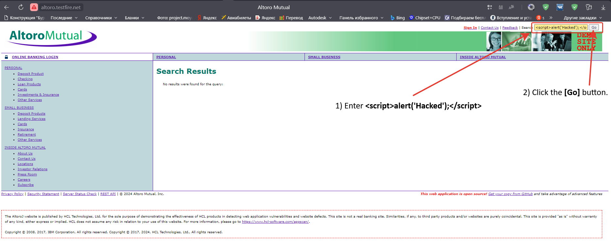

4. As a result, the message "*Hacked*" will appear.

   

### Web Application Potentially Vulnerable to Clickjacking

|||
|-------------------|---|
| __Synopsis__      | Clickjacking, a subset of UI redressing, is a malicious technique whereby a web user is deceived into interacting (*in most cases by clicking*) with something other than what the user believes they are interacting with. |
| __Description__   | While being logged in to some target system, the victim visits the adversary's malicious site which displays a UI that the victim wishes to interact with. In reality, the clickjacked page has a transparent layer above the visible UI with action controls that the adversary wishes the victim to execute. The victim clicks on buttons or other UI elements they see on the page which actually triggers the action controls in the transparent overlaying layer. Depending on what that action control is, the adversary may have just tricked the victim into executing some potentially privileged (and most certainly undesired) functionality in the target system to which the victim is authenticated |
| __Prerequisites__ | 1. The victim is communicating with the target application via a web based UI and not a thick client</br>2. The victim's browser security policies allow at least one of the following JavaScript, Flash, iFrames, ActiveX, or CSS.</br>3. The victim uses a modern browser that supports UI elements like clickable buttons (*i.e. not using an old text only browser*)</br>4. The victim has an active session with the target system.</br>5. The target system's interaction window is open in the victim's browser and supports the ability for initiating sensitive actions on behalf of the user in the target system. |
| __Risk Factor__   | *Medium* |
| __Solution__      | Return the X-Frame-Options or Content-Security-Policy (*with the 'frame-ancestors' directive*) HTTP header with the page's response.</br>This prevents the page's content from being rendered by another site when using the frame or iframe HTML tags. |

Proof Of Concept (*PoC*):

1. Open any text editor.
2. Create a new HTML file.
3. Enter the following code

   ```html
   <!DOCTYPE html>
   <html lang="en">

   <head>
       <meta charset="UTF-8">
       <meta name="viewport" content="width=device-width, initial-scale=1.0">
       <title>Clickjack test page</title>
   </head>

   <body>
       <iframe src="http://altoro.testfire.net/bank/transfer.jsp" width="700" height="900"></iframe>
   </body>
   </html>
   ```

4. Save and open this page in your browser.
5. If the landing page appears, this tells us about a clickjacking vulnerability.

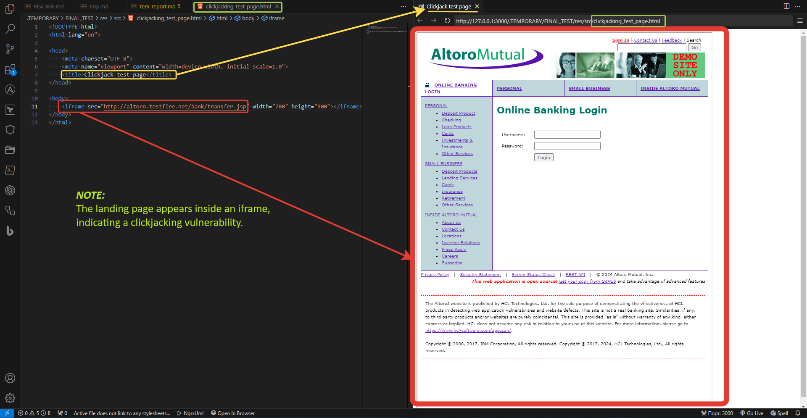

### HTML Injections

|||
|-------------------|---|
| __Synopsis__      | The web application receives input from an upstream component, but it does not neutralize or incorrectly neutralizes special characters such as `<`, `>`, and `&` that could be interpreted as web-scripting elements when they are sent to a downstream component that processes web pages. |
| __Description__   | This may allow such characters to be treated as control characters, which are executed client-side in the context of the user's session. Although this can be classified as an injection problem, the more pertinent issue is the improper conversion of such special characters to respective context-appropriate entities before displaying them to the user. |
| __Prerequisites__ | Development and implementation stage that the development team did not foresee. |
| __Risk Factor__   | *Medium* |
| __Solution__      | Carefully check each input parameter against a rigorous positive specification (*allowlist*) defining the specific characters and format allowed. All input should be neutralized, not just parameters that the user is supposed to specify, but all data in the request, including hidden fields, cookies, headers, the URL itself, and so forth. A common mistake that leads to continuing XSS vulnerabilities is to validate only fields that are expected to be redisplayed by the site. |

Proof Of Concept (*PoC*):

1. Open the website <https://altoro.testfire.net>.
2. Enter the following code into the search bar.

   ```html
   <pre>
       <a href="FishingSiteOrSiteWithMalware"><h1>HTML Injection link</h1></a>
   </pre>
   ```

3. Press the `[F12]` button (*to open the developer toolbar*).
4. As we can see, our HTML code is injected in the DOM.


### Cookie Injection Scripting

|||
|---|---|
| __Synopsis__ | A web application that is potentially vulnerable to cookie attacks. |
| __Description__ | The web application does not strip special characters from query strings, and an attacker could change the state of cookies to bypass authentication.</br>By exploiting this issue, an attacker could inject arbitrary cookies or launch a "*Session Fixation*" attack. |
| __Prerequisites__ | 1. Possibility of an XSS attack (*Cross-Site Scripting*) for the purpose of introducing malicious code</br>2. The CSRF security token is not used.</br> The SID regeneration requirements is not performed for every request.</br>4. The Retrieve only server-generated SIDs attribut is missing.</br>5. The HttpOnly and SameSite cookie attribute is missing. |
| __Risk Factor__ | Medium |
| __Solution__ | - Restrict access to the vulnerable application.</br>- Store state information and sensitive data on the server side only.</br>- Ensure that the system definitively and unambiguously keeps track of its own state and user state and has rules defined for legitimate state transitions.</br>- Do not allow any application user to affect state directly in any way other than through legitimate actions leading to state transitions. |

Proof Of Concept (*PoC*):

1. Open the website <https://altoro.testfire.net>.
2. Enter the following code into the search bar.

   ```html
   <script>document.cookie="JSESSIONID=F59A68AC457BFFE28AF57217D7256493;"</script>
   ```

3. Press the `[F12]` button (*to open the developer toolbar*).
4. As we can see, our HTML code is injected in the DOM.

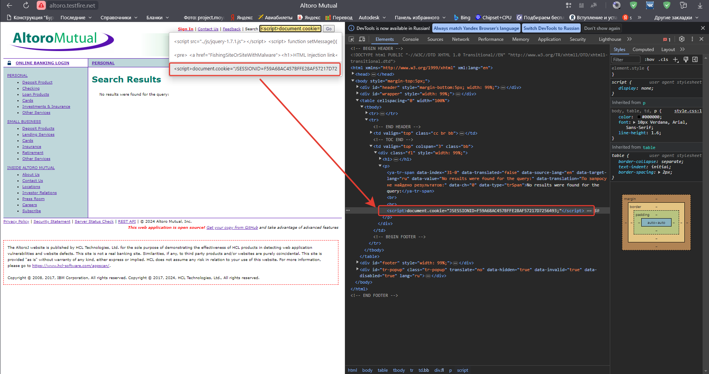

### Absence of Anti-CSRF Tokens

|||
|-------------------|---|
| __Synopsis__      | No Anti-CSRF tokens were found in a HTML submission form. |
| __Description__   | A cross-site request forgery is an attack that involves forcing a victim to send an HTTP request to a target destination without their knowledge or intent in order to perform an action as the victim. The underlying cause is application functionality using predictable URL/form actions in a repeatable way. The nature of the attack is that CSRF exploits the trust that a web site has for a user. By contrast, cross-site scripting (XSS) exploits the trust that a user has for a web site. Like XSS, CSRF attacks are not necessarily cross-site, but they can be. Cross-site request forgery is also known as CSRF, XSRF, one-click attack, session riding, confused deputy, and sea surf. |
| __Prerequisites__ | - The victim has an active session on the target site.</br>- The victim is authenticated via HTTP auth on the target site.</br>- The victim is on the same local network as the target site. |
| __Risk Factor__   | *Medium* |
| __Solution__      | - Use a vetted library or framework that does not allow this weakness to occur or provides constructs that make this weakness easier to avoid.</br>- Ensure that your application is free of cross-site scripting issues, because most CSRF defenses can be bypassed using attacker-controlled script.</br>- Generate a unique nonce for each form, place the nonce into the form, and verify the nonce upon receipt of the form. Be sure that the nonce is not predictable.</br>- Check the HTTP Referer header to see if the request originated from an expected page. This could break legitimate functionality, because users or proxies may have disabled sending the Referer for privacy reasons. |

Proof Of Concept (*PoC*):

1. Open the website <https://altoro.testfire.net>.
2. Click the `[Sign in]` button.
3. Enter *Username:* `' OR 1=1 --` and *Password:* `q` to check for the SQLi vulnerability.

   

4. Click the `[Login]` button.

   

5. Go to the "*Transfer Funds*" page.
6. Prepare a transaction from user *800006* to __800005__ for *150*.

   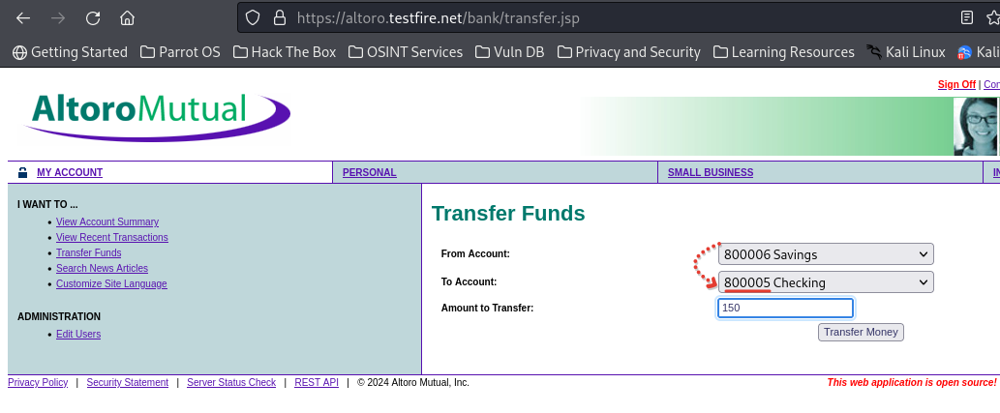

7. To get the admin session ID, launch the "*Burp Suite*".
8. Go to the "*Proxy*" tab.
9. Click the `[Intercept is Off]` button (*to activate interception*).
10. Return to the browser and click the `[Transfer money]` button.
11. At this moment, the traffic is intercepted and we, in the person of the attacker, receive the administrator’s session ID.

    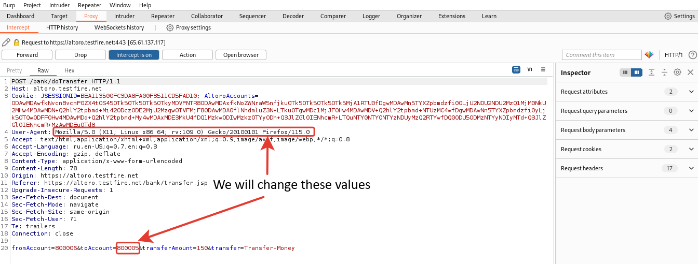

12. To confirm that the request came from a location other than the user's browser, replace the User-Agent value with `Burp`.

    > __IMPORTANT:__
    >
    > If there was a form authentication system, attempts to __manipulate data from another location would be impossible!__

13. To change the recipient, change the recipient ID from *800005* to the credit card number *4539082039396288*.
14. Click the `[Forward]` button.
15. Click the `[Intercept is on]` button (*to disable interception*).

    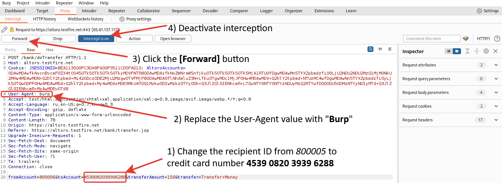

16. Let's return to the browser.
17. A message at the bottom of the page indicates that the amount of "__150.0 was successfully transferred from Account 800006 into 4539082039396288__" instead of user account *800005*.

    

18. Open the "*View Recent Transactions*" page and make sure once again that the system performed actions not on behalf of the user, but on behalf of the attacker.

    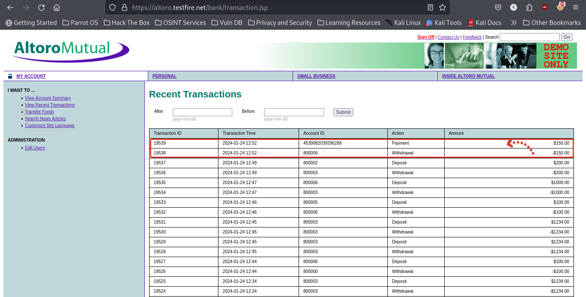

### Web Server Transmits Cleartext Credentials

|||
|-------------------|---|
| __Synopsis__      | The web application transmits sensitive or security-critical data in cleartext in a communication channel that can be sniffed by unauthorized actors. |
| __Description__   | Many communication channels can be "sniffed" (monitored) by adversaries during data transmission. For example, in networking, packets can traverse many intermediary nodes from the source to the destination, whether across the internet, an internal network, the cloud, etc. Some actors might have privileged access to a network interface or any link along the channel, such as a router, but they might not be authorized to collect the underlying data. As a result, network traffic could be sniffed by adversaries, spilling security-critical data. |
| __Prerequisites__ | - This weakness is caused by missing a security tactic during the architecture and design phase.</br>- For hardware, this may be introduced when design does not plan for an attacker having physical access while a legitimate user is remotely operating the device. |
| __Risk Factor__   | *Low* |
| __Solution__      | Make sure that every sensitive form transmits content over HTTPS. |

Proof Of Concept (*PoC*):

1. Open the website <https://altoro.testfire.net>.
2. On the left side of the address bar we see an exclamation mark (*`!`*), when you click on it, a message appears stating that only the HTTP protocol is used and all data is transmitted without encoding.

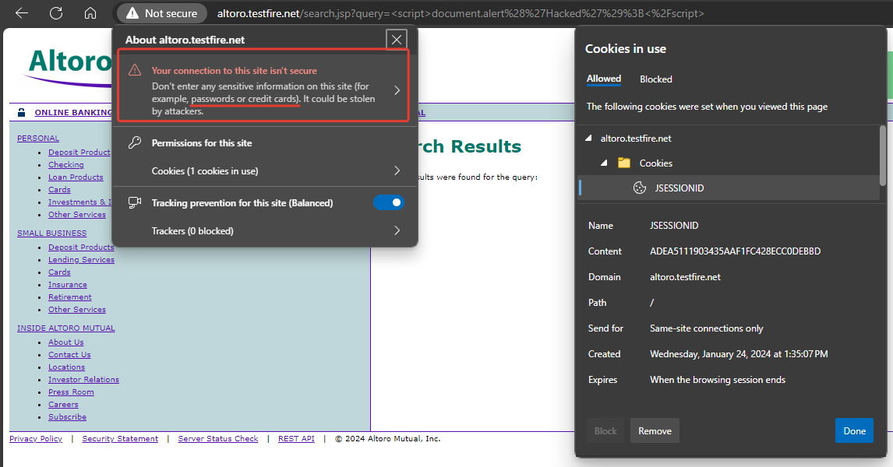

### HTTP Cookie without 'Secure' attribute

|||
|-------------------|---|
| __Synopsis__      | HTTP session cookies might be transmitted in cleartext. |
| __Description__   | The web application runs over unencrypted HTTP, or the cookies are not marked as "*secure*", which means that sensitive cookies are sent over an unencrypted channel. As a result, a remote attacker could intercept these cookies. |
| __Prerequisites__ | The web application does not have a security certificate or is not configured correctly. |
| __Risk Factor__   | *Low* |
| __Solution__      | - Always set the secure attribute when the cookie should sent via HTTPS only.</br>- Check your server configuration to always use HTTPS. |

Proof Of Concept (*PoC*):

1. Open the website <https://altoro.testfire.net>.
2. Press the `[F12]` button (*to open the developer toolbar*).
3. Go to the *Application/Storage* tab.
4. Expand the *cookies* menu.
5. We see that there are no security flags.


### HTTP Cookie without 'SameSite' attribute

|||
|-------------------|---|
| __Synopsis__      | The SameSite attribute for sensitive cookies is not set, or an insecure value is used. |
| __Description__   | The SameSite attribute controls how cookies are sent for cross-domain requests. This attribute may have three values: '*Lax*', '*Strict*', or '*None*'. If the '*None*' value is used, a website may create a cross-domain POST HTTP request to another website, and the browser automatically adds cookies to this request. This may lead to Cross-Site-Request-Forgery (*CSRF*) attacks if there are no additional protections in place (*such as Anti-CSRF tokens*). |
| __Prerequisites__ | The web application does not have a security certificate or is not configured correctly. |
| __Risk Factor__   | *Low* |
| __Solution__      | - Always set the secure attribute when the cookie should sent via HTTPS only.</br>- Check your server configuration to always use HTTPS. |

Proof Of Concept (*PoC*):

1. Open the website <https://altoro.testfire.net>.
2. Press the `[F12]` button (*to open the developer toolbar*).
3. Go to the *Application/Storage* tab.
4. Expand the *cookies* menu.
5. We see that there are no security flags.


### Missing or Permissive __"*X-Frame-Options*"__ and __"*CSP frame-ancestors*"__ HTTP Response Headers

|||
|-------------------|---|
| __Synopsis__      | The web application does not restrict or incorrectly restricts frame objects or UI layers that belong to another application or domain, which can lead to user confusion about which interface the user is interacting with. |
| __Description__   | A web application is expected to place restrictions on whether it is allowed to be rendered within frames, iframes, objects, embed or applet elements. Without the restrictions, users can be tricked into interacting with the application when they were not intending to. |
| __Prerequisites__ | The developers did not set the security HTTP Response Headers: "__X-Frame-Options__" and "__Content-Security-Policy__". |
| __Risk Factor__   | *Info* |
| __Solution__      | - Set a properly configured *X-Frame-Options* and *Content-Security-Policy frame-ancestors* headers for all requested resources</br>- The use of *X-Frame-Options* and *Content-Security-Policy frame-ancestors* allows developers of web content to restrict the usage of their application within the form of overlays, frames, or iFrames. The developer can indicate from which domains can frame the content.</br>- A developer can use a "*frame-breaker*" script in each page that should not be framed. |

Proof Of Concept (*PoC*):

1. Open the website <https://altoro.testfire.net>.
2. Press the `[F12]` button (*to open the developer toolbar*).
3. This header is missing inside the `<head>` tag.
4. We will get the same result if we use any network traffic analysis tools (Burp Suite, Wireshark, etc.).

   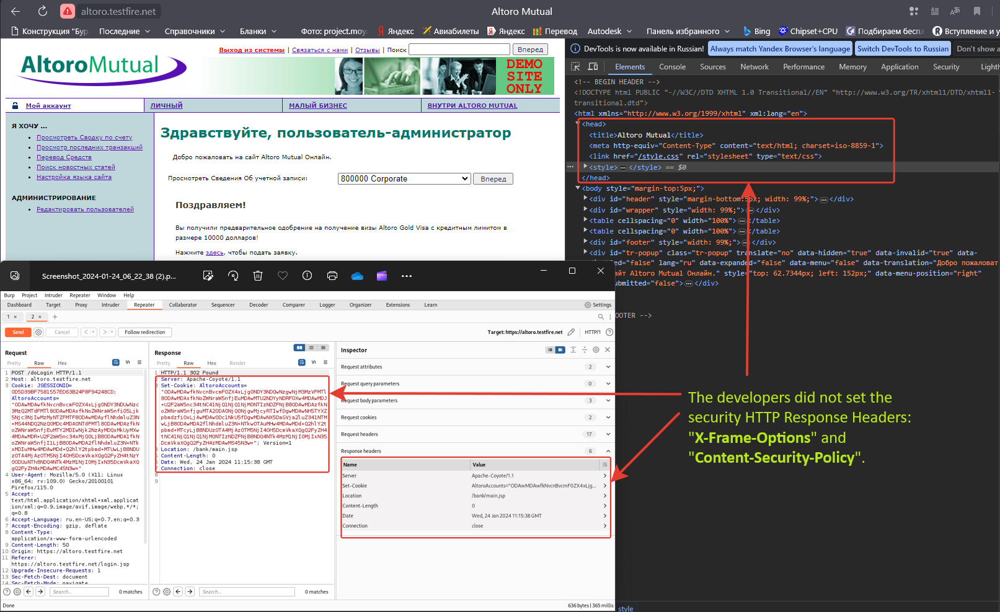

5. XSS (*Cross-Site Scripting*), clickjacking, and cross-site leak vulnerabilities are possible if these headers are missing.

### HyperText Transfer Protocol (HTTP) Information

|||
|-------------------|---|
| __Synopsis__      | Some information about the remote HTTP configuration can be extracted. |
| __Description__   | Preventing version disclosure is often considered best practice as it slows down hackers. Conventional wisdom holds that you should prevent any information from getting out at all, or on the other end of the scale, that the disclosing the versions of software you are using doesn’t make any difference. |
| __Prerequisites__ | *None* |
| __Risk Factor__   | *Collection of information* |
| __Solution__      | *None* |

Proof Of Concept (*PoC*):

1. Open a terminal (*`[Ctrl]`+`[Alt]`+`[T]`*).
2. Enter the following command.

   ```html
   curl -v http://altoro.testfire.net
   ```

3. As you can see, here is information about the protocol, port, server version, etc.

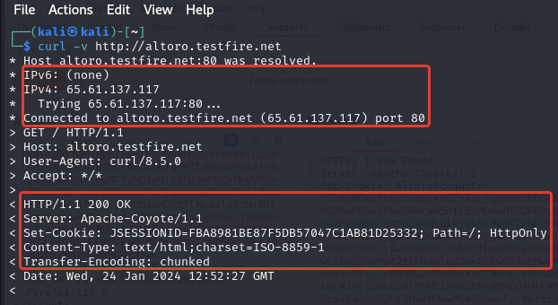
