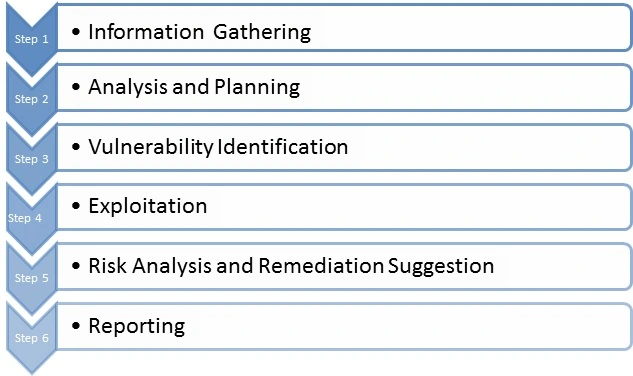

# [Web Application Security Testing](../README.md) -> __Report for the 20231211 lesson 1__

- [Web Application Security Testing -\> __Report for the 20231211 lesson 1__](#web-application-security-testing---report-for-the-20231211-lesson-1)
  - [__Introduction__](#introduction)
  - [__Document Properties__](#document-properties)
  - [__Version control__](#version-control)
  - [__List Of Illustrations__](#list-of-illustrations)
  - [__1. EXECUTIVE SUMMARY__](#1-executive-summary)
    - [1. Scope of work](#1-scope-of-work)
    - [2. Project Objectives](#2-project-objectives)
    - [3. Assumption](#3-assumption)
    - [4. Timeline](#4-timeline)
    - [5. Summary of Findings](#5-summary-of-findings)
    - [6. Summary of Recommendation](#6-summary-of-recommendation)
  - [__2. METHODOLOGY__](#2-methodology)
    - [1. Planning](#1-planning)
    - [2. Exploitation](#2-exploitation)
    - [3. Reporting](#3-reporting)
  - [__3. DETAIL FINDINGS__](#3-detail-findings)
    - [1. Detailed systems information](#1-detailed-systems-information)
    - [2. Windows server 192.168.1.75](#2-windows-server-192168175)
  - [__4. References__](#4-references)

## __Introduction__

Black Box Penetration Testing
For IT Academy WAST Course Lesson `#`
V`1`.0

`December` `##`th, 202`3`

By: Selivonchyk S.

## __Document Properties__

| Title             | Black Box Penetration Testing Report  |
|-------------------|---------------------------------------|
| Version           | V`1`.0                                  |
| Author            | Selivonchyk S.                        |
| Pen-testers       | Selivonchyk S.                        |
| Reviewed By       | Kutaisov M.                           |
| Approved By       | Kutaisov M.                           |
| Classification    | Confidential                          |

## __Version control__

| Version   | Date              | Author                | Description   |
|-----------|-------------------|-----------------------|---------------|
| V`#`.0      | `Dec` `##`th, 202`#`    | Selivonchyk Serhey    | `#`   |

Table of Content

1. EXECUTIVE SUMMARY
   1. [Scope of work](#1-scope-of-work)
   2. [Project objectives](#2-project-objectives)
   3. [Assumption](#3-assumption)
   4. [Timeline](#4-timeline)
   5. [Summary of findings](#5-summary-of-findings)
   6. [Summary of recommendation](#6-summary-of-recommendation)
2. METHODOLOGY
   1. [Planning](#1-planning)
   2. [Exploitation](#2-exploitation)
   3. [Reporting](#3-reporting)
3. DETAIL FINDINGS
   1. [Detailed systems information](#1-detailed-systems-information)
   2. [Windows server 192.168.1.75](#2-windows-server-192168175)
4. References

APPENDIX A NESSUS VULNERABILITY SCANNING REPORTS

## __List Of Illustrations__

- List of Tables

  - __Table 1__ *Penetration Testing Time Line*

  - __Table 2__ *Total Risk Rating*

  - __Table 3__ *Risk Analysis*

  - __Table 4__ *Rating Calculation*

  - __Table 5__ *Targets open ports*

- List of Figures

  - __Figure 1__ *Total Risks*

  - __Figure 2__ *Penetration Testing Methodology*

  - __Figure 3__ *`192.168.1.75` Number of Risks*

  - __Figure 4__ *Telnet Service Banner*

  - __Figure 5__ *Exploiting RPC using dcom*

  - __Figure 6__ *Getting Shell Access*

  - __Figure 7__ *Exploiting dcom – metasploit*

  - __Figure 8__ *Uploading nc.exe as backdoor*

  - __Figure 9__ *Shell command and running nc*

  - __Figure 10__ *Downloading SAM file*

## __1. EXECUTIVE SUMMARY__

This document details the security assessment (external penetration testing) of
GPEN.KM. The purpose of the assessment was to provide a review of the security
posture of GPEN.KM Internet infrastructure, as well, as to identify potential weaknesses
in its Internet infrastructure.

### 1. Scope of work

This security assessment covers the remote penetration testing of 2 accessible
servers hosted on 192.168.1.75 and 192.168.1.76 addresses. The assessment was carried
out from a black box perspective, with the only supplied information being the tested
servers IP addresses. No other information was assumed at the start of the assessment.

### 2. Project Objectives

This security assessment is carried out to gauge the security posture of GPEN.KM’s
Internet facing hosts. The result of the assessment is then analyzed for vulnerabilities.
Given the limited time that is given to perform the assessment, only immediately
exploitable services have been tested. The vulnerabilities are assigned a risk rating based
on threat, vulnerability and impact.

### 3. Assumption

While writing the report, we assume that both IP addresses are considered to be
public IP addresses, NDA and rules of engagement has been signed and based on the
information gathering phase the company name is GPEN.KM.

### 4. Timeline

The timeline of the test is as below:

| Penetration Testing   | Start Date/Time   | End Date/Time |
|:---------------------:|:-----------------:|:-------------:|
| Pen Test 1            | mm/dd/yyyy        | mm/dd/yyyy    |

> __Table 1:__ *Penetration Testing Time Line*

### 5. Summary of Findings

| Value     | Number of Risks   |
|:---------:|:-----------------:|
| Low       | 3                 |
| Medium    | 2                 |
| High      | 6                 |
| Critical  | 6                 |

> __Table 2:__ *Total Risk Rating*


> __Figure 1:__ *Total Risks*

### 6. Summary of Recommendation

## __2. METHODOLOGY__



> __Figure 2:__ *Penetration Testing Methodology*

### 1. Planning

### 2. Exploitation

### 3. Reporting

```txt
Risk = Threat * Vulnerability * Impact
```

| Threat        | Low | |    |    | Medium ||   |    | High |  |     |    | Critical  ||||
|---------------|---|---|----|----|---|----|----|----|----|----|-----|----|----|----|----|----|
| Vulnerability | L | M | H  | C  | L | M  | H  | C  | L  | M  | H   | C  | L  | M  | H  | C  |
| Low           | 1 | 2 | 3  | 4  | 1 | 4  | 6  | 8  | 3  | 6  | 9   | 12 | 4  | 8  | 12 | 16 |
| Medium        | 2 | 4 | 6  | 8  | 4 | 8  | 12 | 16 | 6  | 12 | 18  | 24 | 8  | 16 | 24 | 32 |
| High          | 3 | 6 | 9  | 12 | 6 | 12 | 18 | 24 | 9  | 18 | 27* | 36 | 12 | 24 | 36 | 48 |
| Critical      | 4 | 8 | 12 | 16 | 8 | 16 | 24 | 32 | 12 | 24 | 36  | 48 | 16 | 32 | 48 | 64 |

> __Table 3:__ *Risk Analysis*

||||
|-------|-----------|-------|
| L     | Low       | 1-16  |
| M     | Medium    | 17-32 |
| H     | High      | 33-48 |
| C     | Critical  | 49-64 |

> __Table 4:__ *Rating Calculation*

## __3. DETAIL FINDINGS__

### 1. Detailed systems information

### 2. Windows server 192.168.1.75

## __4. References__
